# 锂电池建模

> GitLab 仓库: https://gitlab.com/tongji_620_group/tongji_micro_grid_program.git

- 需求：实现具有基本功能的锂电池仿真模型，用于后续控制仿真

- Lithium-Battery BMS Functional Structure :star:

  BMS(Battery Management System) >> 电池模型所需要有的功能+架构

  > 选用 2-RC ECM 作为电池模型

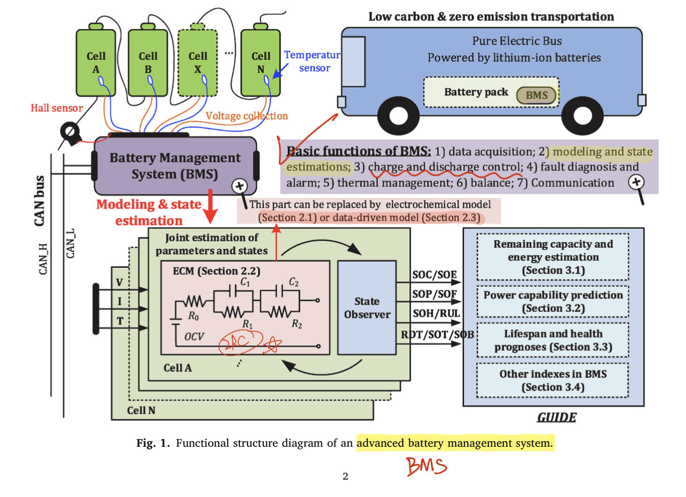


## basics

> - SOC、SOH [博客参考](https://electricalvoice.com/state-of-charge-soc-state-of-health-soh/)

开发精确电池模型的第一步是**构建等效电路并将其参数化**，以反映电池的非线性行为以及与温度、SOC、SOH 及电流的相关性

- SOC(State of Charge) ：电量百分比

$$
SOC\% = \underbrace{Q_{remain}}_\text{电池剩余电荷容量} /  \underbrace{Q_{rated}}_\text{电池标定电荷总容量}
$$

- SOH(State of Health)：电池当前的容量与出厂容量的百分比，在BMS( 电池管理系统) 用于**评估电池弱化状态**及失效状态
  $$
  SOH\% = A*放电深度+B*倍率+C*环境温度+D*日历寿命
  $$

- OCV(Open circuit voltage) 开路电压：电池不放电开路时，两极之间的电位差

- Coulombic Efficiency：衡量 Battery Efficiency

  > [参考](https://batteryuniversity.com/article/bu-808c-coulombic-and-energy-efficiency-with-the-battery)
  > coulomb 库仑(电量单位) is a unit of electric charge.  One coulomb equals one ampere-second (1As).

- Convection Resistance  <a name="Convection"> </a>
  
  > [参考](https://techweb.rohm.com/knowledge/thermal-design/s-thermal-design/01-s-thermal-design/9554) :star:
  
  **Convection: Heat moves to a fluid, and Fluid (Heat) Moves.**
  
  - **Natural convection** is flow driven by the buoyancy that arises from **temperature differences** in the fluid.
  - **Forced convection** is flow driven by external factors, such as a fan or a pump.
  
  $$
  T_{\text{surface}} - T_\text{fluid} = R_{th}  \times W_\text{heat flow amount}\\
  \underbrace{R_{th}}_\text{thermal resistance in convection} = \frac{1}{h_m \times Area_{surface}} \\
  h_m:\text{convective heat transfer coefficient}
  $$
  
  From the equation, we see that as the surface area of the object increases, the thermal resistance of convection decreases.


## review 选型

> :beer: **需求：了解锂电池模型有哪几种实现方式，模型选型**
> paper listed format：`yearPublish_citedNum_Title`

- [2016_c312_SystematicReviewOfLumpedParameterEMC_RealTimeLithiumBattery](https://sci-hub.ru/https://www.sciencedirect.com/science/article/pii/S0378775316302427)  

  > [local papaer](./docs/LithiumBattery/2016_c312_SystematicReviewOfLumpedParameterEMC_RealTimeLithiumBattery.pdf) :warning: 2016 年的 review！
  
  讨论了三大类 battery model，比较了10个具体的 EMC 方法
  
  - Electrochemical models :shit:
      使用 PDE方程计算，准确率很高，但计算复杂度高，存在过拟合问题，导致输出的不确定性，**很少实际应用**
  
  - Data-driven model：大量实验获取电池数据，拟合实验数据
      误差大（5-20%），不可解释
  
  - lumped-param EMC 等效电路 :star: :+1:  误差 3% 左右
  
  建议用 **two-RC model structure ，搭配 hystersis** 能够进一步减少电压误差


- [2020_c311_aComprehensiveReviewOfBatteryModelingAndStateEstimation](https://sci-hub.ru/https://www.sciencedirect.com/science/article/pii/S1364032120303063) :star:  :+1:

  > [local pdf](./docs/LithiumBattery/2020_c299_aComprehensiveReviewOfBatteryModelingAndStateEstimation.pdf)
  >
  > - Section2：讨论 3大类电池模型
  > - Section3：SOTA 电池状态(SOC，SOH等指标)估计方法

  **根据此 review 查询三大类别模型，总结在下面！:baby_chick:**
  


### Electrochemical model

> **难以用于实时场景**，由大量变量要在优化时候要确定，**容易过拟合+局部最优**，若不用准确的参数，仿真效果很不理想

- Single-Particle Model：用于研究电子的固态传播；:shit: low accuracy

- P2D Model [参考](https://www.sciencedirect.com/science/article/pii/S0378775320301063)

  电池阴阳极认为由无数球状电子组成，分子之间充满电解液；电解液中分子的液态、固态用 PDEs 偏微分方程描述


### ECM :star:

> **常用于实时场景**：模型结构简单，参数确定容易；
> ECM 可分为2类：integral-order ECM, fractional-order ECM

- Integral-order ECM

  > 参数少，计算复杂度低》》仿真快
  > 问题 :warning: ：用 bode 图，EIS 方法分析电池模型特性，对于中间频率，电池的 Nyquist 曲线不是半圆，说明**标准的 RC ECM 模型不适合用于所有频率** 

  - N-RC ECM
    [3 RC Model 考虑 OCV 的 hysteresis延迟特性，进一步提升 accuracy 参考](https://www.sciencedirect.com/science/article/pii/S0378775311000681)

  

- Fractional-order ECM :star:

  > 使用 CPEs(constant phase element) 代替 RC 网络中的电容，更准确，计算复杂度高》》仿真慢
  >
  > [参考](https://www.scopus.com/record/display.uri?eid=2-s2.0-84940518972&origin=inward)
  >
  > [A novel fractional order model based state-of-charge estimation method for lithium-ion battery - ScienceDirect](https://www.sciencedirect.com/science/article/pii/S0306261917308668)
  
  - 两类ECM优缺点
    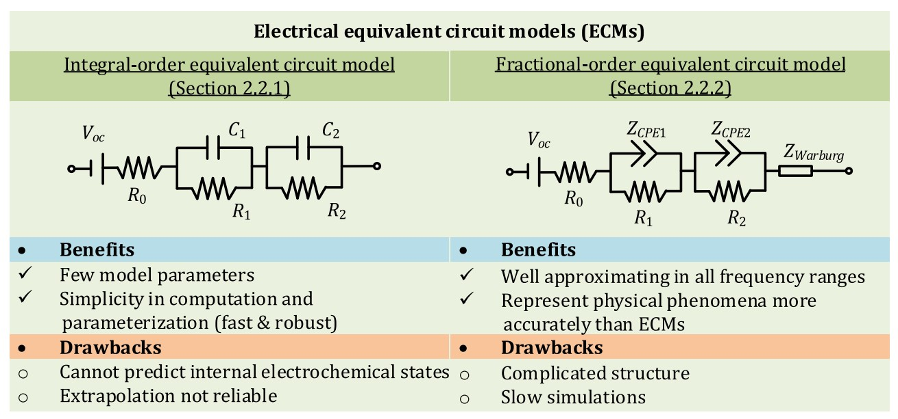


- [2012_c462_HighFidelityLithiumBatteryModelwithThermalEffect](https://www.researchgate.net/publication/254026768_High_fidelity_electrical_model_with_thermal_dependence_for_characterization_and_simulation_of_high_power_lithium_battery_cells) :star:

  > [MATLAB 官方教程参考](https://ww2.mathworks.cn/solutions/power-electronics-control/battery-models.html)  有源码！:beer:  
  > [local paper](./docs/LithiumBattery/2012_c462_HighFidelityLithiumBatteryModelwithThermalEffect.pdf) 
  
  - 使用 1个 RC Block 的 EMC 等效电路来模拟，**在T=20 °C，下电压误差 <= 2%**，和实际比差不多，后面可以增加 RC block数量增加复杂度。 
  - 问题
    - 模拟多个恒定温度下，仿真的 SOC、Volage、Current 变化，没考虑温度随使用时间增加的变化
    - 计算温度的公式，只考虑单个 cell，实际锂电池由多个 cell 组成 pack，实际温度计算存在差异

- [2021_c15_InvestigationOnLithium-ionBatteryEquivalentCircuit](https://sci-hub.ru/https://onlinelibrary.wiley.com/doi/abs/10.1002/est2.231)

  > [local pdf](./docs/LithiumBattery/2021_c15_InvestigationOnLithium-ionBatteryEquivalentCircuit.pdf)

  调研 N-RC ECM 锂电池模型，验证了 $N:1\rightarrow5$ 下各个ECM 仿真表现+验证。
  结论：3-RC ECM 平均误差最小


### Data-driven

- [2015_c140_DataDriven_Stateof EnergyEstimationLithium-ionBatteriesBasedNeuralNetworkModel.pdf](https://sci-hub.ru/https://www.sciencedirect.com/science/article/pii/S0360544215010154)

  > [local pdf](./docs/LithiumBattery/2015_c140_DataDriven_Stateof EnergyEstimationLithium-ionBatteriesBasedNeuralNetworkModel.pdf)
  > 误差 4%左右，比RC EMC 模型稍差一点 :warning: 2015年！

  - 对**状态空间**拟合>>SoE随时间变动
    输入当前 k 时刻变量： $SoE(k)$（比SoC更能反应电池剩余容量）,温度 $T(k)$，上一时刻的电池电压 $V(k-1)$，**通过 NN 拟合非线性映射**，得到当前时刻电池电压 $V(k)$

  - NN 输出为了降低噪声，使用 a particle filter estimator 过滤得到最终电池电压

    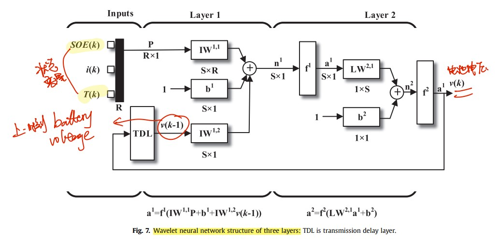

    

- [2017_c327_Remaining Useful Life Prediction and State of Health Diagnosis for Lithium-Ion Batteries Using Particle Filter and Support Vector Regression](https://ieeexplore.ieee.org/abstract/document/8186223)

  > [local pdf](./docs/LithiumBattery/2017_c327_DataDriven_SVM.pdf)

  根据电池参数（前一时刻 battery capacity，charged capacity，时间常数）作为输入，使用 SVR 拟合非线性特征，**输出 capacity degradation 电池退化能力**。


## RC-ECM 电池建模

> [Modeling Batteries Using Simulink and Simscape +调参](https://ww2.mathworks.cn/videos/modeling-batteries-using-simulink-and-simscape-1562930245321.html) :star:
> [matlab 锂电池建模视频](https://ww2.mathworks.cn/videos/estimating-parameters-of-a-battery-68957.html) 
> [电池建模 视频1](https://ww2.mathworks.cn/videos/matlab-simulink-racing-lounge-battery-modeling-with-simulink-96690.html) 
> [Lithium Battery Model with Thermal Effects 视频](https://ww2.mathworks.cn/videos/lithium-battery-model-with-thermal-effects-for-system-level-analysis-81886.html) 
> [MATLAB 官方教程参考](https://ww2.mathworks.cn/solutions/power-electronics-control/battery-models.html) 
>
> [Simulink 设计 BMS 白皮书](https://ww2.mathworks.cn/campaigns/offers/battery-management-systems-white-paper.html)
> [Simscape Battery官方文档](https://ww2.mathworks.cn/help/simscape-battery/get-started-simscape-battery.html) :+1:

**电池建模步骤**：开发精确电池模型的第一步是**构建等效电路并将其参数化**，以反映电池的非线性行为以及与温度、SOC、SOH 及电流的相关性；Parameterize ECM；Refine Estimation

### TODO :taco:

- [ ] **单个电池** 

  - [x] 电池模型选型

  - [x] 搭建单个电池仿真模型：输入电流，输出 SOC，OCV。

  - [x] **Param Estimate 流程**：电流电压的真实电池数据，对RC电路参数估计

    > 分别对于3个温度，真实电池的 [t, i, u] 数据，去拟合 lookup-table 参数

  - [x]  理解参数估计更新参数原理：Parameter-Estimation 优化原理：MSE+非线性最小二乘>>优化；

    > LookUp-Table 如何用在 optimization?

  - 优化项

    - [ ] SOC estimate：对电池输入电流、测量的端电压加噪声（模拟传感器误差），使用 UKF 跟踪

      > 待了解 UKF模块实现原理

    - [ ] 电池 Aging：多次循环充放电，AEKF 预测期间电池 $R_0$ 变化

    - [ ]  N-RC 模型，增加 hysteresis 延迟特性，进一步提升拟合准确率

- [ ] **电池组**

  - [x] 调研官方电池组模型，**搭建电池组模块**：串联 + `heat_flow`
  - [x] 理解 heat_flow 模块连接原理，及模块 `convection simscape` 代码
  - BMS

    - [ ] passive Balancing
    - [ ] SOC 预测：UKF 控制跟踪算法
    - [ ] 充放电控制


### 单个电池

> [锂电池 ECM 原理 博客参考](https://zhuanlan.zhihu.com/p/407572989)

- ECM 模型方程
  
  
  
  R0 为内阻，电压源为开路电压 Em。
  
  
  $$
  \text{电容}\quad I_{c} = C * \frac{d U_c}{dt} \\
  \text{电感}\quad U_L = L * \frac{di}{dt} \\
  \text{ECM OCV:}\\\quad OCV=E_m(SOC, T) + U_{RC1} + U_{RC2}+ \underbrace{I}_\text{外部输入电流}*R_0\\
  I = \frac{U_{RCi}}{Ri} + C_i*{\frac{dU_{RCi}}{dt}}\\
  $$
  
  - `E_m` 模块：$SOC=1-\frac{Q_e}{C}$ ,  $Qe = \int_{0}^{t}{I_m(\tau)d\tau}$
  - 待拟合参数：$R0, Em, Ri, Ci$


- Battery (Table-Based) Simscape` 官方模块:star: 

  > [matlab 官方文档](https://ww2.mathworks.cn/help/sps/ref/batterytablebased.html)
  > [Lookup Table 参考](https://www.zhihu.com/question/67505855) 
  > :grey_question: [仿真时，配置参数设置里`output_times`参数无效](https://blog.csdn.net/qq_36847641/article/details/88812294)
  >
  > 可调整 RC 模块数目 N：待调整参数：$ E_m,R_1,R_0,C_i，...$， 对每一次输入，用` look-up table` 查表的方式，每一个参数不是一个标量，是 10x1 的向量，分别对应十个SOC
  >
  > - **缺点 :shit: ：模块无法看到底层实现，查看封装只能找到 `.p` 文件，为预编译好的文件，无法查看**

- 2RC 等效电路

  > 参考官方`batteryModeling_version2017` 中 `ssc_lithium_cell_1RC_estim.slx` 文件，各模块逻辑使用 `Simscape component` 实现（ssc官方文件，可编辑）  
  >
  > 根据数据固定即电路中的可变参数 $E_m \quad R_0 \quad R_1,C_1$ 根据当前 SOC 来查找 1D_LookUpTable，获取当前状态下对应的 Em, R0, R1,C1，之后根据各模块各自的欧姆定律计算 $电流i,电压u$

  2RC 电池 simulink 模型

  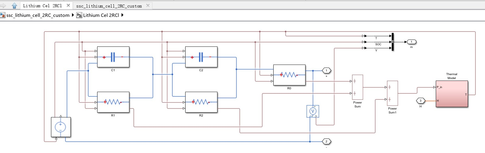

  - usage：输入电流和外部温度，电池模块除了 u，i的其他输出(SOC, 电池温度)

    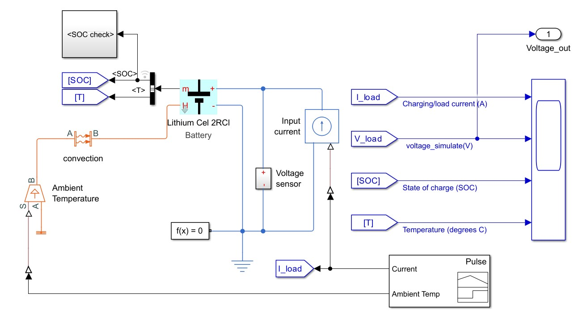

  

- `foundation.electrical.electrical` >>在自定义模块中声明

  > [参考](https://ww2.mathworks.cn/help/simscape/lang/electrical-domain.html)

  ```matlab
  domain electrical
  % Electrical Domain
  % Copyright 2005-2013 The MathWorks, Inc.
  
    parameters
      Temperature = { 300.15 , 'K'     }; % Circuit temperature
      GMIN        = { 1e-12  , '1/Ohm' }; % Minimum conductance, GMIN
    end
  
    variables
      v = { 0 , 'V' };
    end
  
    variables(Balancing = true)
      i = { 0 , 'A' };
    end
  
  end
  ```

  - Across variable *v* (voltage), in volts
  - Through variable *i* (current), in amperes
  - Parameter *Temperature*, specifying the circuit temperature
  - Parameter *GMIN*, specifying minimum conductance


### Parameter Estimate

> [Matlab 参数估计教程](https://ww2.mathworks.cn/help/sldo/gs/estimate-parameters-from-measured-data-using-the-gui.html)
> [电池参数估计 博客](https://zhuanlan.zhihu.com/p/57051144)

- 使用 `Parameter Estimator` 优化各个参数 (工具栏->APP->参数估计器)
  

- :grey_question: 加入温度变量，再一起拟合数据，soc 起始0.4 +拟合很烂？
  论文对多个温度 $T1, T2, T3$，**单独在每个温度 $Ti$ 下单独进校参数估计** :star:，即定死一个温度，收集数据，去估计在 7 个SOC level 下对应的 $E_m, R_i, Ci$ 参数 (1x7数组)，得到最终 `LookUp-Table` 对应温度下的一列，全部数据求完最后平起来得到 2D table

  > :ticket: tips: 最终电池模型的会考虑温度，各个参数 Ri,Em 根据 2 个输入 SOC, Temperature 去事先求得的 2D LookUp-Table 插值查表得到对应的变量值
  >
  > | Table_element is variable_value (example Em) | T1(℃)  | T2     | T3     |
  > | -------------------------------------------- | :----: | ------ | ------ |
  > | SOC_level1                                   | 3.4966 | 3.5057 | 3.5148 |
  > | SOC_level2                                   |        |        |        |
  > | ...                                          |        |        |        |
  > | SOC_level7                                   |        |        |        |

- 拟合完保存 session，模型参数 $R_i, C_i, E_m$ 可以保存成 mat 文件

  ```matlab
  save('ssc_lithium_cell_2RC_paramEstimation_20celsius_1iter.mat', 'C1', 'C2', 'Em', 'R0', 'R1', 'R2')
  ```

  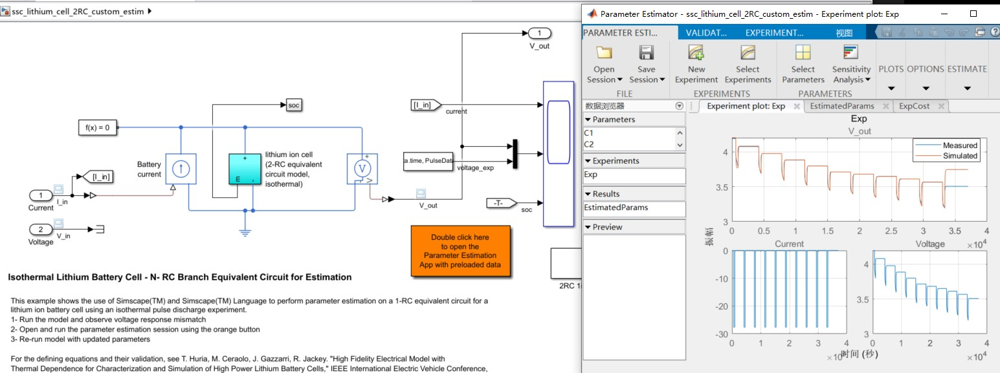

- `tablelookup(x1d, x2d, x3d, x4d, fd, x1, x2, x3, x4, interpolation = linear|smooth, extrapolation = linear|nearest|error)` 

  > [Lookup-Table 模块使用 官方文档](https://ww2.mathworks.cn/help/simscape/lang/tablelookup.html)
  > [lookup-Table 原理](https://ww2.mathworks.cn/help/simulink/ug/about-lookup-table-blocks.html)


#### 优化方法

> :grey_question:LookUp Table 在参数估计时候如何更新参数？
> [官方论文参考local pdf](./docs/LithiumBattery/2013_BatteryModelParameterEstimationUsingLayeredTechnique.pdf) 
> [How the Software Formulates Parameter Estimation as an Optimization Problem](https://ww2.mathworks.cn/help/sldo/ug/optimization-problem-formulation-for-parameter-estimation.html)

损失函数：使用 `MSE` ，误差 $error = MSE(OCV_{simulate}, OCV_{truth}) $；**Optimization Method**  可选择 **Nonlinear Least Squares**，Gradient Descent, Simple Search, Pattern Search 方法。

> [Methods For Non-Linear Least Squares Problems 博客参考](https://zhuanlan.zhihu.com/p/93344177) :star:
>
> [Netwon's method 参考](https://calcworkshop.com/derivatives/newtons-method/)
> [最小二乘-》牛顿法参考](https://zhuanlan.zhihu.com/p/113946848):star:

求解非线性最小二乘问题：使得 F(X) >> 理解为损失函数，在一组参数 X 下最小

- 最速下降法：$h=-F''(x)$ 梯度反向 >> $F(x) \rightarrow F(x+ah)$ **求步长 a**

- 最小化 $ a = argmin_{a>0} F(x+ah)$  获取步长，该求解过程需要迭代计算，不过线搜索法实际中不怎么采用，一方面计算比较耗时，另一方面是没有必要获得如此精确的步长。
  最速下降法为在最后的收敛阶段收敛很慢。因此为了在最后的收敛阶段获得较快的收敛速度，通常将**最速下降法与其他方法混合使用（hybrid methods）****，在下降的初始阶段使用最速下降法，在收敛阶段使用其他二次收敛方法，如牛顿法。

- 牛顿法
  $$
  x=x_0 的二阶Taylor展开：\\
  f(x) = f(x_0) + f'(x_0)*(x-x_0) + \frac{f''(x_0)}{2}*(x-x_0)^2 + \underbrace{O(x-x_0)^2}_{可忽略} \\
  对x求导>> f'(x) = f'(x_0) + f''(x_0)*(x-x_0) \\
  令x=x_1(极值)，s.t. f'(x_1)=0 \\
  >> x_1 = x_0 - \frac{f'(x_0)}{f''(x_1)}\\
  >> x_{n+1} = x_n - \frac{f'(x_n)}{f''(x_n)}
  $$
  如果是多元的情况，则一阶导数 $f'(x)$ 被叫做梯度 （**矩阵的梯度为一阶导的转置，函数的梯度为一阶导**）>> `Jacobian 矩阵`；二阶导数矩阵 $f''(x)$ ，也被叫做 `Hessian 矩阵`

  > `Jacobian 矩阵`，`Hessian 矩阵` :baby_chick: TODO

  $$
  \triangle{x}=x_{n+1}-x_{n} = -\frac{f'(x_n)}{f''(x_n)} = -\frac{J}{H} \\
  $$

  由于牛顿法需要算二阶导数，如果高阶的话，需要算海塞矩阵，这里是有三个**缺陷**,因此，需要思考别的方法来进行最小二乘问题的优化和求解。

  - 要求**给定的方程需要二阶可导**
  - 非凸函数的海森矩阵不一定有逆
  - 数据较大的时候，海塞矩阵的**计算量偏大**


- 混合方法需要解决的问题是两种方法切换的策略，存在两种不同切换策略的混合方法，分别是**信任区域法**和**阻尼法**

  - 列文伯格-马夸特法（**信赖区域**）：动态调整步长
    $$
    \rho = \frac{f(x+\triangle{x})-f(x)}{J(x)^T*\triangle{x}}
    $$

    -  $\rho$ 接近1，近似是好的，不需要更改；
    -  $\rho$ 太小，**则实际减少的值小于近似减少的值**，近似较大，需要缩小近似的范围；
    -  $\rho$ 太大，则实际减少的值大于近似减少的值，近似较小，需要扩大近似的范围。

### 电池组

> - Battery of 80 Cells：考虑 SOC，温度，各节电池**串联**
>   [ssc_lithium_battery_80Cells.slx](./LithiumIonBattery\batteryModeling_version2017/ssc_lithium_battery_80Cells.slx)

- 电池组串联
  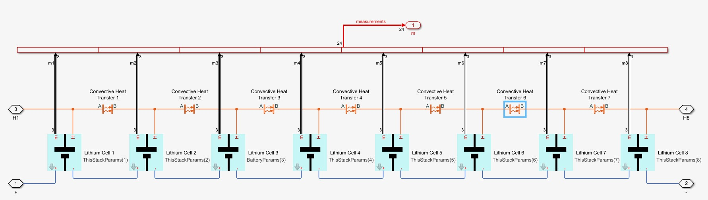

  usage：
  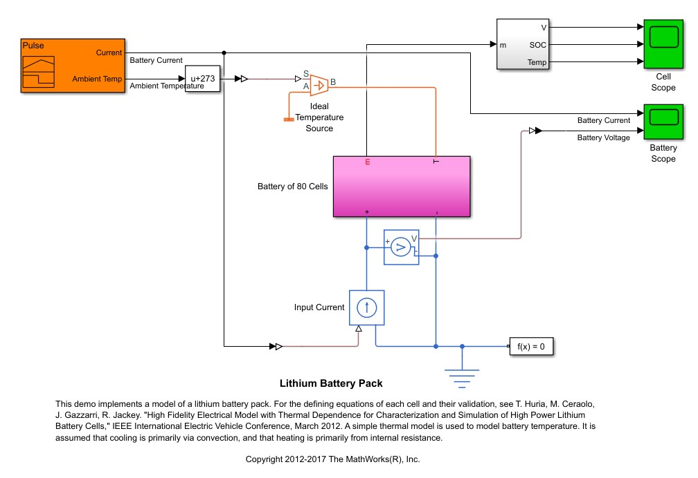
  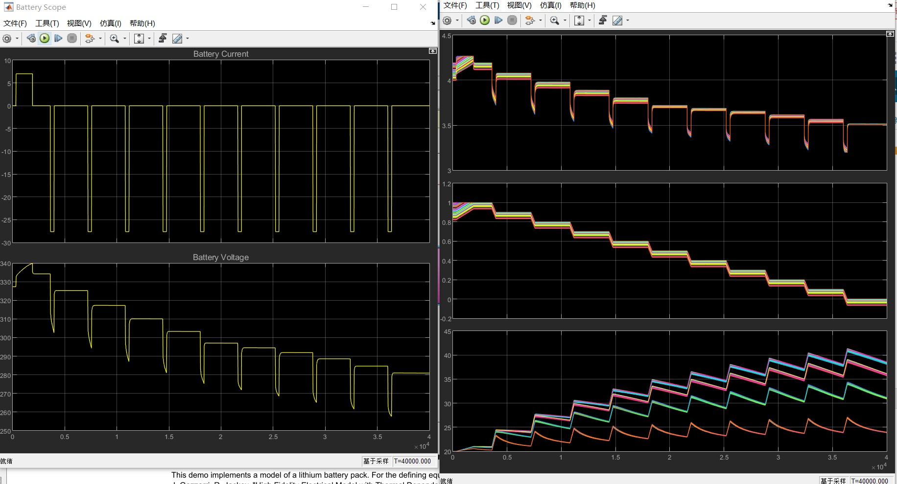
  
- BMS 官方示例中的电池组
  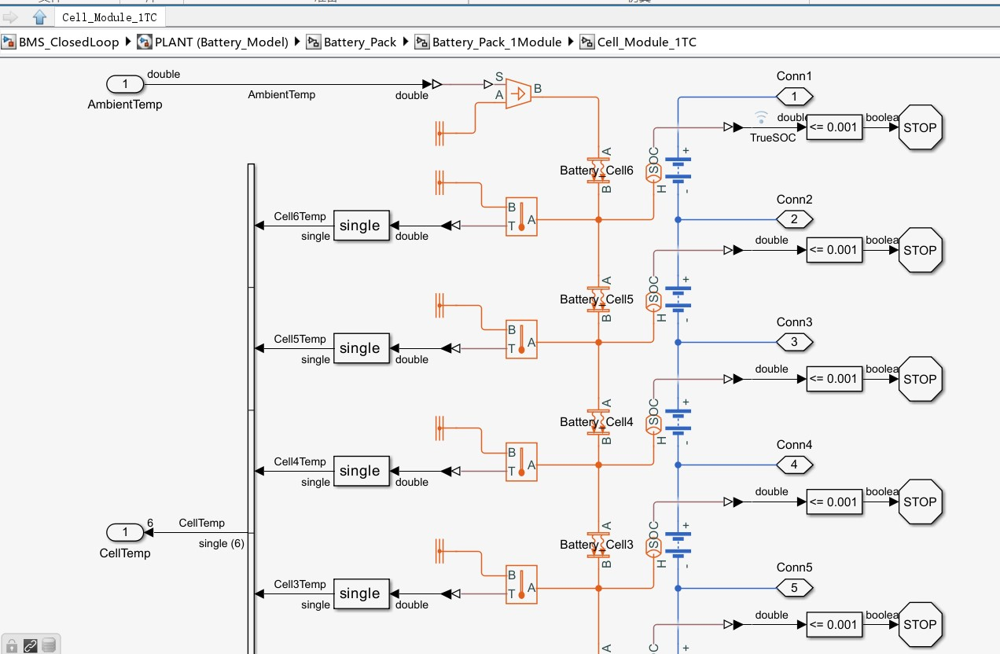


### heat convection :fire:

> [simulink model: ssc_lithium_battery_80Cells.slx](./LithiumIonBattery\batteryModeling_version2017/ssc_lithium_battery_80Cells.slx)
>
> - :grey_question:电池组外面有 2 个同向的 `convective Heat transfer` 模块？
>   convective Heat transfer 模块：**positive direction is from port A to port B**, the **heat flow is positive if it flows from A to B**. 温度交换是双向的，比较AB点 heat flow （温度?）决定方向

- the rate of heat transfer 原理

  > [参考前面 basics 热传导公式](#Convection)

  $$
  \underbrace{Q}_\text{heat flow} = area * \text{HeatTransferCoeff} * (T_A - T_B)
  $$

  The Convective Heat Transfer block represents **heat transfer by convection between two bodies** by means of fluid motion.
  **A** and **B** are thermal conserving ports associated with the points between which the heat transfer by convection takes place. Because the **block positive direction is from port A to port B**, the heat flow is positive if it flows from **A** to **B**.


- Ideal Temperature Source

  > [参考](https://ww2.mathworks.cn/help/simscape/lang/thermal-domain.html)

  ```matlab
  component controlled_temperature
  % Controlled Temperature Source
  %...
  inputs
      S = {293.15, 'K'}; % S:bottom
  end
  
  nodes
      A = foundation.thermal.thermal; % A:bottom
      B = foundation.thermal.thermal; % B:top
  end
  
  variables (Access=private, Conversion=relative)
      T = {0, 'K'}; % Temperature difference
  end
  
  variables (Access=private)
      Q = {0, 'W'}; % Heat flow rate
  end
  
  branches
      Q : B.Q -> A.Q;
  end
  
  equations
      T == B.T - A.T;
      T == S;
  end
  
  end
  ```

  这里的 `foundation.thermal.thermal` :arrow_down:

  ```matlab
  # Thermal Domain
  domain thermal
  % Thermal domain
  
  % Copyright 2005-2013 The MathWorks, Inc.
  
    variables
      T = { 0 , 'K' };
    end
  
    variables(Balancing = true)
      Q = { 0 , 'J/s' };
    end
  ```

- Convective Heat Transfer

  > [官方文档](https://ww2.mathworks.cn/help/simscape/ref/convectiveheattransfer.html)

  represents heat transfer by convection between two bodies by means of fluid motion. The **Newton law of cooling** describes the transfer
  $$
  Q = \underbrace{k}_{传热系数} * SurfaceArea * (T_A - T_B) \\
  $$

  - **The heat transfer coefficient, *k***, can be either constant, which you specify by using the **Heat transfer coefficient** parameter, or variable, which you specify by using the physical signal at port **K**.
  - Because the block **positive direction is from port A to port B**, the **heat flow is positive if it flows from A to B**.

- 单个电池内部的温度模块：获取温度用于之后 $E_m, R_i, C_i, R_0$ 查表
  

  H 端口：外部连接电池时，传入的 `heat_flow` ；P_in 端口：电池 ECM 中 2 电阻输出的 $Q(W)=u*i $

  - Thermal mass

    > [官方文档](https://ww2.mathworks.cn/help/simscape/ref/thermalmass.html?searchHighlight=thermal%20mass&s_tid=srchtitle_thermal%20mass_1)

    The Thermal Mass block represents a thermal mass that **reflects the ability of a material, or a combination of materials, to store internal energy.**
    $$
    Q_{heatFlow} = c * m* \frac{dT}{dt} \\
    $$
    *Q* is the heat flow.；*c* is the specific heat of the mass material.；
    *m* is the mass. (`BatteryParams(idx).cell_mass = 1; %kg`)；*T* is the temperature.；*t* is time.

    the block **positive direction is from the port towards the block（default have one thermal conserving port）**, the heat flow is **positive if it flows into the block.**

  - Controlled Heat Flow Rate Source

    > [参考](https://ww2.mathworks.cn/help/simscape/ref/controlledheatflowratesource.html?searchHighlight=heat%20flow&s_tid=srchtitle_heat%20flow_3)

    The block positive direction is from port A to port B. This means that **positive signal at port S generates heat flow in the direction from A to B.**


### SOC estimate

> UKF(Unscented Kalman Filter) >> Nonlinear state estimation
> [博客参考](https://towardsdatascience.com/the-unscented-kalman-filter-anything-ekf-can-do-i-can-do-it-better-ce7c773cf88d) :star:

希望电池SOC保持在 0.3-0.9 范围，使用状态转换方式，放电状态下当电池SOC不足，转为充电状态，当SOC到达0.9 转换为放电状态。

- 充电保持[Current Amplitude](https://www.sciencedirect.com/topics/immunology-and-microbiology/current-amplitude) 在15A，放电使用 Pulse 脉冲输出+随机扰动
- 电池模块各个输出变量（输出 SOC, 测量得到的电压，测量得到的电流）增加随机噪声，使用 UKF 预测SOC，目标想要和真实 SOC 近似

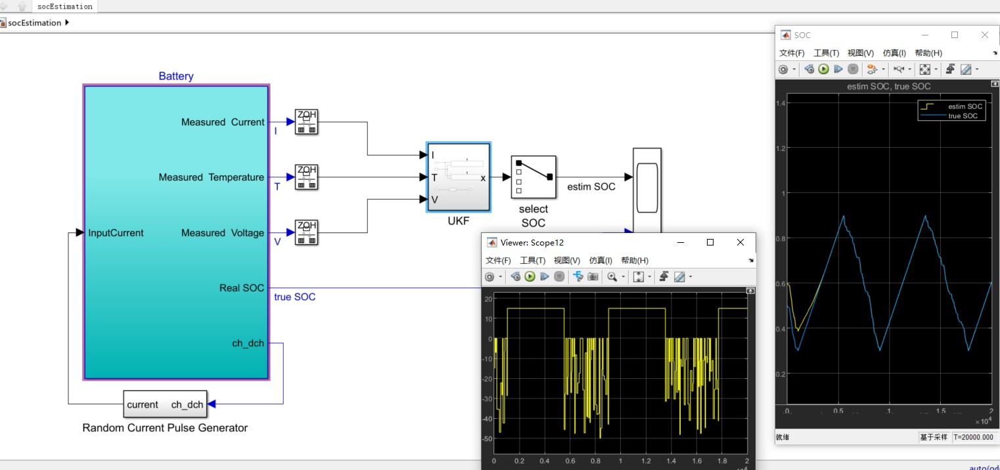


## BMS 控制 （TODO）

> [Matlab BMS 充放电控制咨询_视频教程](https://ww2.mathworks.cn/services/consulting/proven-solutions/battery-simulation-and-controls.html)
> [Microgrid BMS](https://ww2.mathworks.cn/matlabcentral/fileexchange/60550-microgrid-hybrid-pv-wind-battery-management-system?s_tid=ta_fx_results)
> [Youtube Matlab 官方BMS视频](https://www.youtube.com/playlist?list=PLn8PRpmsu08pYXwR-qihN6abrK3Io97NN)  :star:
> [BMS_ProjectFileExchange](https://ww2.mathworks.cn/matlabcentral/fileexchange/72865-design-and-test-lithium-ion-battery-management-algorithms)
>
> - :grey_question: youtube下面官方给出 export file url 是 `bit.ly 短链接`怎么访问 
>  `hxxps://http://bit.ly/xxxxxx`换成`hxxps://j.mp/xxxxxx`
>
>  :warning: 下载用 `wget` 下载，否则可能下载下来的zip损坏（只有80K）不能用

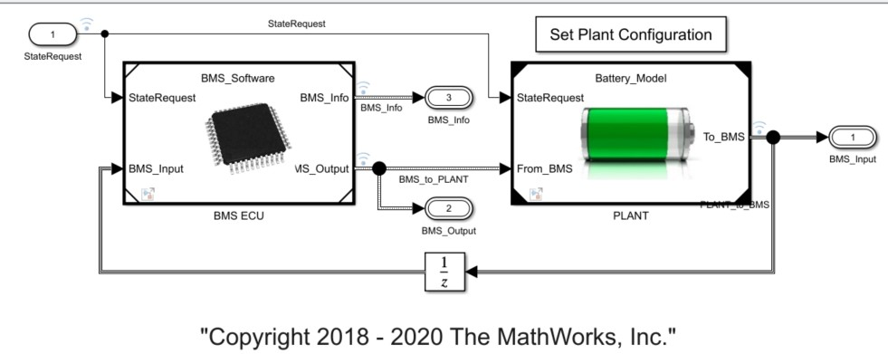

- :grey_question:(BMS 反馈 + 控制算法) **控制对象**
  - 监测电芯电压和温度
  - 估计荷电状态 (SOC) 和健康状态 (SOH) 
  - **限制功率输入和输出**，以实现散热和过充保护 
  - 控制电池充电曲线 
  - 平衡各个电芯的荷电状态 
  - 必要时将电源和电池隔离

### BMS ECU

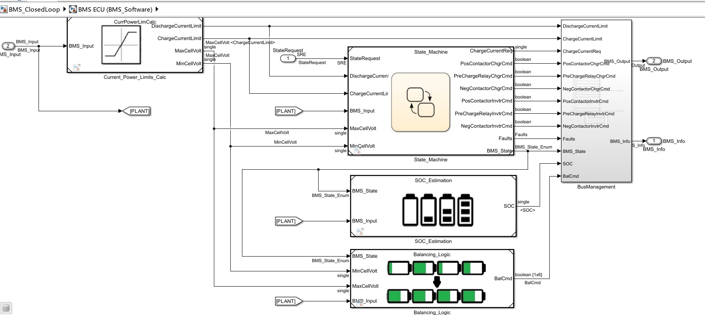

- 充放电状态转换
- SOC预测
- passive Balancing


### BatteryModel

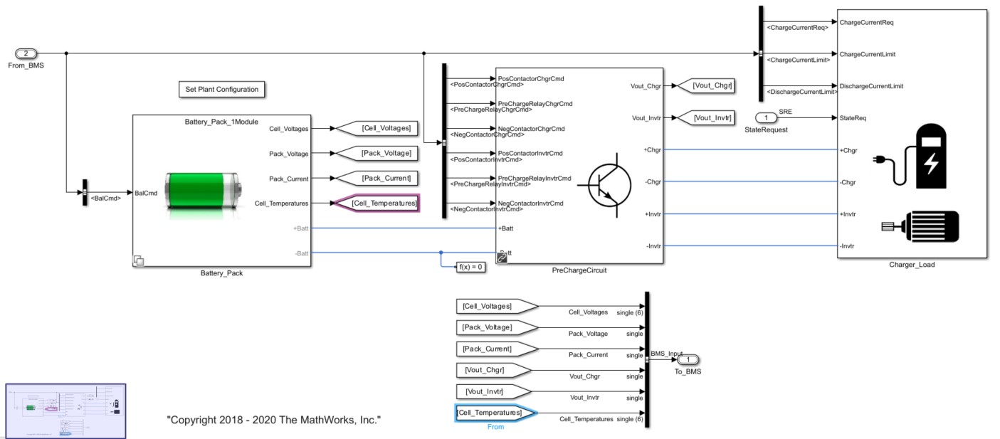

- `passive balancing circuit`
  需要放电时候，开关关必放电，降低 SOC，实现电池均衡，更好利用电池组总容量

- PreCharge circuit
  在电池组和充电器之间，加上一个电阻，防止激增的电流输入，损坏电池

- 充电装置 + DriveLoad 负载
