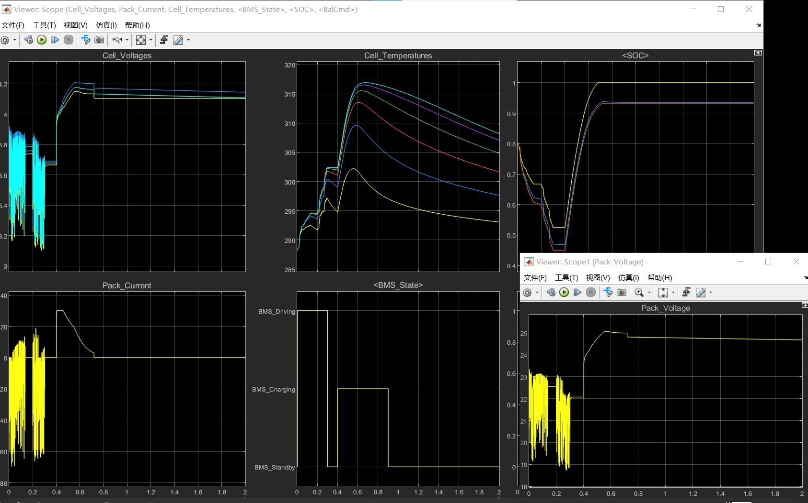
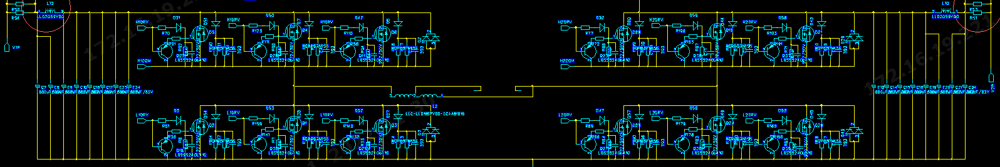
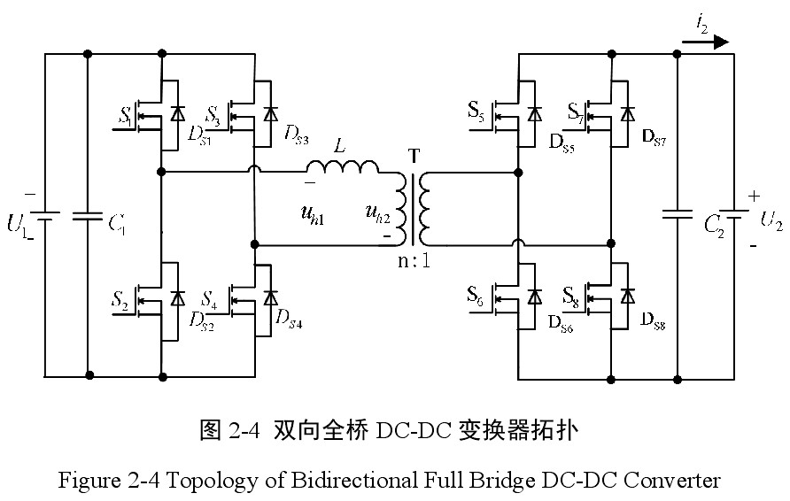
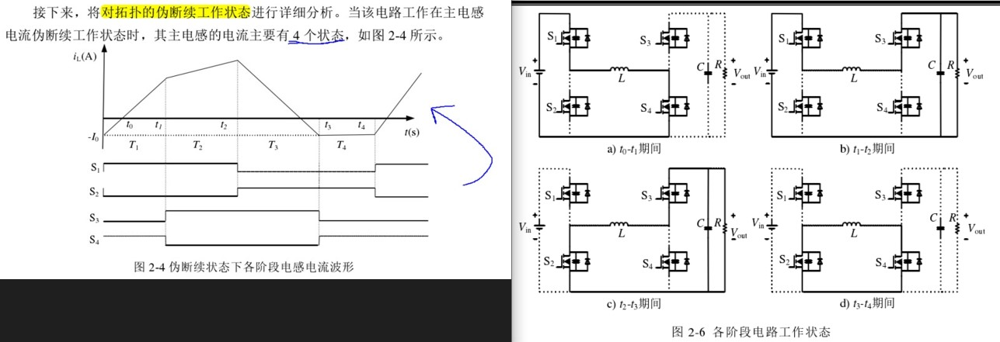

# 锂电池建模

> Gitte 仓库: https://gitee.com/tongji620_-group/tongji_micro_grid_program.git
> [96V 混动平台仿真进度表](https://epropulsion.feishu.cn/sheets/shtcnCAXpokp1OzqzOkEQzbrPze)
>
> [开关电源相关电子书 pdf 上这个网站找找看](http://download.eeworld.com.cn/detail/eisbergeisberg/625410)

- 需求：实现具有基本功能的锂电池仿真模型，用于后续控制仿真

- Lithium-Battery BMS Functional Structure :star:

  BMS(Battery Management System) >> 电池模型所需要有的功能+架构

  > 选用 `2-RC ECM` 作为电池模型


## basics

> - SOC、SOH [博客参考](https://electricalvoice.com/state-of-charge-soc-state-of-health-soh/)

开发精确电池模型的第一步是**构建等效电路并将其参数化**，以反映电池的非线性行为以及与温度、SOC、SOH 及电流的相关性

- SOC(State of Charge) ：电量百分比

$$
SOC\% = \underbrace{Q_{remain}}_\text{电池剩余电荷容量} /  \underbrace{Q_{rated}}_\text{电池标定电荷总容量}
$$

- SOH(State of Health)：电池当前的容量与出厂容量的百分比，在BMS( 电池管理系统) 用于**评估电池弱化状态**及失效状态
  $$
  SOH\% = A*放电深度+B*倍率+C*环境温度+D*日历寿命
  $$

- OCV(Open circuit voltage) 开路电压：电池不放电开路时，两极之间的电位差

- Coulombic Efficiency：衡量 Battery Efficiency

  > [参考](https://batteryuniversity.com/article/bu-808c-coulombic-and-energy-efficiency-with-the-battery)
  > coulomb 库仑(电量单位) is a unit of electric charge.  One coulomb equals one ampere-second (1As).

- Convection Resistance  <a name="Convection"> </a>
  
  > [参考](https://techweb.rohm.com/knowledge/thermal-design/s-thermal-design/01-s-thermal-design/9554) :star:
  
  **Convection: Heat moves to a fluid, and Fluid (Heat) Moves.**
  
  - **Natural convection** is flow driven by the buoyancy that arises from **temperature differences** in the fluid.
  - **Forced convection** is flow driven by external factors, such as a fan or a pump.
  
  $$
  T_{\text{surface}} - T_\text{fluid} = R_{th}  \times W_\text{heat flow amount}\\
  \underbrace{R_{th}}_\text{thermal resistance in convection} = \frac{1}{h_m \times Area_{surface}} \\
  h_m:\text{convective heat transfer coefficient}
  $$
  
  From the equation, we see that as the surface area of the object increases, the thermal resistance of convection decreases.


## review 选型

> :beer: **需求：了解锂电池模型有哪几种实现方式，模型选型**
> paper listed format：`yearPublish_citedNum_Title`

- [2016_c312_SystematicReviewOfLumpedParameterEMC_RealTimeLithiumBattery](https://sci-hub.ru/https://www.sciencedirect.com/science/article/pii/S0378775316302427)  

  > [local papaer](./docs/LithiumBattery/2016_c312_SystematicReviewOfLumpedParameterEMC_RealTimeLithiumBattery.pdf) :warning: 2016 年的 review！
  
  讨论了三大类 battery model，比较了10个具体的 EMC 方法
  
  - Electrochemical models :shit:
      使用 PDE方程计算，准确率很高，但计算复杂度高，存在过拟合问题，导致输出的不确定性，**很少实际应用**
  
  - Data-driven model：大量实验获取电池数据，拟合实验数据
      误差大（5-20%），不可解释
  
  - lumped-param EMC 等效电路 :star: :+1:  误差 3% 左右
  
  建议用 **two-RC model structure ，搭配 hystersis** 能够进一步减少电压误差


- [2020_c311_aComprehensiveReviewOfBatteryModelingAndStateEstimation](https://sci-hub.ru/https://www.sciencedirect.com/science/article/pii/S1364032120303063) :star:  :+1:

  > [local pdf](./docs/LithiumBattery/2020_c299_aComprehensiveReviewOfBatteryModelingAndStateEstimation.pdf)
  >
  > - Section2：讨论 3大类电池模型
  > - Section3：SOTA 电池状态(SOC，SOH等指标)估计方法

  **根据此 review 查询三大类别模型，总结在下面！:baby_chick:**
  


### Electrochemical model

> **难以用于实时场景**，由大量变量要在优化时候要确定，**容易过拟合+局部最优**，若不用准确的参数，仿真效果很不理想

- Single-Particle Model：用于研究电子的固态传播；:shit: low accuracy

- P2D Model [参考](https://www.sciencedirect.com/science/article/pii/S0378775320301063)

  电池阴阳极认为由无数球状电子组成，分子之间充满电解液；电解液中分子的液态、固态用 PDEs 偏微分方程描述


### ECM :star:

> **常用于实时场景**：模型结构简单，参数确定容易；
> ECM 可分为2类：integral-order ECM, fractional-order ECM

- Integral-order ECM

  > 参数少，计算复杂度低》》仿真快
  > 问题 :warning: ：用 bode 图，EIS 方法分析电池模型特性，对于中间频率，电池的 Nyquist 曲线不是半圆，说明**标准的 RC ECM 模型不适合用于所有频率** 

  - N-RC ECM
    [3 RC Model 考虑 OCV 的 hysteresis延迟特性，进一步提升 accuracy 参考](https://www.sciencedirect.com/science/article/pii/S0378775311000681)

  

- Fractional-order ECM :star:

  > 使用 CPEs(constant phase element) 代替 RC 网络中的电容，更准确，计算复杂度高》》仿真慢
  >
  > [参考](https://www.scopus.com/record/display.uri?eid=2-s2.0-84940518972&origin=inward)
  >
  > [A novel fractional order model based state-of-charge estimation method for lithium-ion battery - ScienceDirect](https://www.sciencedirect.com/science/article/pii/S0306261917308668)
  
  - 两类ECM优缺点
    


- [2012_c462_HighFidelityLithiumBatteryModelwithThermalEffect](https://www.researchgate.net/publication/254026768_High_fidelity_electrical_model_with_thermal_dependence_for_characterization_and_simulation_of_high_power_lithium_battery_cells) :star:

  > [MATLAB 官方教程参考](https://ww2.mathworks.cn/solutions/power-electronics-control/battery-models.html)  有源码！:beer:  
  > [local paper](./docs/LithiumBattery/2012_c462_HighFidelityLithiumBatteryModelwithThermalEffect.pdf) 
  
  - 使用 1个 RC Block 的 EMC 等效电路来模拟，**在T=20 °C，下电压误差 <= 2%**，和实际比差不多，后面可以增加 RC block数量增加复杂度。 
  - 问题
    - 模拟多个恒定温度下，仿真的 SOC、Volage、Current 变化，没考虑温度随使用时间增加的变化
    - 计算温度的公式，只考虑单个 cell，实际锂电池由多个 cell 组成 pack，实际温度计算存在差异

- [2021_c15_InvestigationOnLithium-ionBatteryEquivalentCircuit](https://sci-hub.ru/https://onlinelibrary.wiley.com/doi/abs/10.1002/est2.231)

  > [local pdf](./docs/LithiumBattery/2021_c15_InvestigationOnLithium-ionBatteryEquivalentCircuit.pdf)

  调研 N-RC ECM 锂电池模型，验证了 $N:1\rightarrow5$ 下各个ECM 仿真表现+验证。
  结论：3-RC ECM 平均误差最小


### Data-driven

- [2015_c140_DataDriven_Stateof EnergyEstimationLithium-ionBatteriesBasedNeuralNetworkModel.pdf](https://sci-hub.ru/https://www.sciencedirect.com/science/article/pii/S0360544215010154)

  > [local pdf](./docs/LithiumBattery/2015_c140_DataDriven_Stateof EnergyEstimationLithium-ionBatteriesBasedNeuralNetworkModel.pdf)
  > 误差 4%左右，比RC EMC 模型稍差一点 :warning: 2015年！

  - 对**状态空间**拟合>>SoE随时间变动
    输入当前 k 时刻变量： $SoE(k)$（比SoC更能反应电池剩余容量）,温度 $T(k)$，上一时刻的电池电压 $V(k-1)$，**通过 NN 拟合非线性映射**，得到当前时刻电池电压 $V(k)$

  - NN 输出为了降低噪声，使用 a particle filter estimator 过滤得到最终电池电压

    

    

- [2017_c327_Remaining Useful Life Prediction and State of Health Diagnosis for Lithium-Ion Batteries Using Particle Filter and Support Vector Regression](https://ieeexplore.ieee.org/abstract/document/8186223)

  > [local pdf](./docs/LithiumBattery/2017_c327_DataDriven_SVM.pdf)

  根据电池参数（前一时刻 battery capacity，charged capacity，时间常数）作为输入，使用 SVR 拟合非线性特征，**输出 capacity degradation 电池退化能力**。


## RC-ECM 电池建模

> [Modeling Batteries Using Simulink and Simscape +调参](https://ww2.mathworks.cn/videos/modeling-batteries-using-simulink-and-simscape-1562930245321.html) :star:
> [matlab 锂电池建模视频](https://ww2.mathworks.cn/videos/estimating-parameters-of-a-battery-68957.html) 
> [电池建模 视频1](https://ww2.mathworks.cn/videos/matlab-simulink-racing-lounge-battery-modeling-with-simulink-96690.html) 
> [Lithium Battery Model with Thermal Effects 视频](https://ww2.mathworks.cn/videos/lithium-battery-model-with-thermal-effects-for-system-level-analysis-81886.html) 
> [MATLAB 官方教程参考](https://ww2.mathworks.cn/solutions/power-electronics-control/battery-models.html) 
>
> [Simulink 设计 BMS 白皮书](https://ww2.mathworks.cn/campaigns/offers/battery-management-systems-white-paper.html)
> [Simscape Battery官方文档](https://ww2.mathworks.cn/help/simscape-battery/get-started-simscape-battery.html) :+1:

**电池建模步骤**：开发精确电池模型的第一步是**构建等效电路并将其参数化**，以反映电池的非线性行为以及与温度、SOC、SOH 及电流的相关性；Parameterize ECM；Refine Estimation

### TODO :taco:

- [x] **单个电池** 

  - [x] 电池模型选型

  - [x] 搭建单个电池仿真模型：输入电流，输出 SOC，OCV。

  - [x] **Param Estimate 流程**：电流电压的真实电池数据，对RC电路参数估计

    > 分别对于3个温度，真实电池的 [t, i, u] 数据，去拟合 lookup-table 参数

  - [x] 理解参数估计更新参数原理：Parameter-Estimation 优化原理：MSE+非线性最小二乘>>优化；

    > LookUp-Table 如何用在 optimization?

  - 优化项
  
    - [ ] SOC estimate：对电池输入电流、测量的端电压加噪声（模拟传感器误差），使用 UKF 跟踪
  
      > 待了解 UKF模块实现原理
  
    - [ ] 电池 Aging：多次循环充放电，AEKF 预测期间电池 $R_0$ 变化
  
    - [ ]  N-RC 模型，增加 hysteresis 延迟特性，进一步提升拟合准确率
  
- [x] **电池组**

  - [x] 调研官方电池组模型，**搭建电池组模块**：串联 + `heat_flow`
  - [x] 理解 heat_flow 模块连接原理，及模块 `convection simscape` 代码

- BMS

  - [x] 完成符合电池容量和 BMS 的仿真
  
  - [x] **双向 DCDC** 实现双向充/放电
  
    > 目前使用一个matlab 官方电池模块模拟整个电池组**。后续若要考虑各个电池的负载均衡，可以进行优化。
  
  - [ ] H 桥双向 DCDC


### 单个电池

> [锂电池 ECM 原理 博客参考](https://zhuanlan.zhihu.com/p/407572989)
> [2012_c462_HighFidelityLithiumBatteryModelwithThermalEffect](https://www.researchgate.net/publication/254026768_High_fidelity_electrical_model_with_thermal_dependence_for_characterization_and_simulation_of_high_power_lithium_battery_cells)

- ECM 模型方程

  

  R0 为内阻，电压源为开路电压 Em。
  待拟合参数：$BatteryCapacity, R0, Em, Ri, Ci$
  $$
  \text{电容}\quad I_{c} = C * \frac{d U_c}{dt} \\
  \text{电感}\quad U_L = L * \frac{di}{dt} \\
  \text{ECM OCV:}\\\quad OCV=E_m(SOC, T) + U_{RC1} + U_{RC2}+ \underbrace{I}_\text{外部输入电流}*R_0\\
  I = \frac{U_{RCi}}{Ri} + C_i*{\frac{dU_{RCi}}{dt}}\\
  $$
  
- `E_m` 电压源

  > SOC 指荷电状态，也叫剩余电量，代表的是电池使用一段时间或长期搁置不用后的**剩余容量与其完全充电状态的容量的比值**，常用百分数表示。其取值范围为0~1，当SOC=0时表示电池放电完全，当SOC=1时表示电池完全充满。

  $$
  Capacity = LookUp(Temp) \qquad\text{initialized with 31 A*hr}\\
  SOC = 1-\frac{Q_e}{Capacity} \\  
  Qe = \int_{0}^{t}{I_m(\tau)d\tau}
  $$

- Cell capacity

  电池电量受多个因素影响

  - 电池平均放电电流，放电时间 :baby:
  - inner cell temperature 电池内部温度 :baby:
  - 放电结束时的电压
  - 电池储存时间，self-discharge 自放电效应
  - Number of charge and discharge cycles 充放电循环次数

  对于短时间内的变化，先考虑`电池平均放电电流，放电时间`，`电池内部温度`


#### 仿真实现

- Battery (Table-Based) Simscape` 官方模块:star: 

  > [matlab 官方文档](https://ww2.mathworks.cn/help/sps/ref/batterytablebased.html)
  > [Lookup Table 参考](https://www.zhihu.com/question/67505855) 
  > :grey_question: [仿真时，配置参数设置里`output_times`参数无效](https://blog.csdn.net/qq_36847641/article/details/88812294)
  >
  > 可调整 RC 模块数目 N：待调整参数：$ E_m,R_1,R_0,C_i，...$， 对每一次输入，用` look-up table` 查表的方式，每一个参数不是一个标量，是 10x1 的向量，分别对应十个SOC
  >
  > - **缺点 :shit: ：模块无法看到底层实现，查看封装只能找到 `.p` 文件，为预编译好的文件，无法查看**

- 2RC 等效电路

  > 参考官方`batteryModeling_version2017` 中 `ssc_lithium_cell_1RC_estim.slx` 文件，各模块逻辑使用 `Simscape component` 实现（ssc官方文件，可编辑）  
  >
  > 根据数据固定即电路中的可变参数 $E_m \quad R_0 \quad R_1,C_1$ 根据当前 SOC 来查找 1D_LookUpTable，获取当前状态下对应的 Em, R0, R1,C1，之后根据各模块各自的欧姆定律计算 $电流i,电压u$

  2RC 电池 simulink 模型

  

  - usage：输入电流和外部温度，电池模块除了 u，i的其他输出(SOC, 电池温度)

    

  

- `foundation.electrical.electrical` >>在自定义模块中声明

  > [参考](https://ww2.mathworks.cn/help/simscape/lang/electrical-domain.html)

  ```matlab
  domain electrical
  % Electrical Domain
  % Copyright 2005-2013 The MathWorks, Inc.
  
    parameters
      Temperature = { 300.15 , 'K'     }; % Circuit temperature
      GMIN        = { 1e-12  , '1/Ohm' }; % Minimum conductance, GMIN
    end
  
    variables
      v = { 0 , 'V' };
    end
  
    variables(Balancing = true)
      i = { 0 , 'A' };
    end
  
  end
  ```

  - Across variable *v* (voltage), in volts
  - Through variable *i* (current), in amperes
  - Parameter *Temperature*, specifying the circuit temperature
  - Parameter *GMIN*, specifying minimum conductance


### Parameter Estimate

> [Matlab 参数估计教程](https://ww2.mathworks.cn/help/sldo/gs/estimate-parameters-from-measured-data-using-the-gui.html)
> [电池参数估计 博客](https://zhuanlan.zhihu.com/p/57051144)

- 使用 `Parameter Estimator` 优化各个参数 (工具栏->APP->参数估计器)
  

- :grey_question: 加入温度变量，再一起拟合数据，soc 起始0.4 +拟合很烂？
  论文对多个温度 $T1, T2, T3$，**单独在每个温度 $Ti$ 下单独进校参数估计** :star:，即定死一个温度，收集数据，去估计在 7 个SOC level 下对应的 $E_m, R_i, Ci$ 参数 (1x7数组)，得到最终 `LookUp-Table` 对应温度下的一列，全部数据求完最后平起来得到 2D table

  > :ticket: tips: 最终电池模型的会考虑温度，各个参数 Ri,Em 根据 2 个输入 SOC, Temperature 去事先求得的 2D LookUp-Table 插值查表得到对应的变量值
  >
  > | Table_element is variable_value (example Em) | T1(℃)  | T2     | T3     |
  > | -------------------------------------------- | :----: | ------ | ------ |
  > | SOC_level1                                   | 3.4966 | 3.5057 | 3.5148 |
  > | SOC_level2                                   |        |        |        |
  > | ...                                          |        |        |        |
  > | SOC_level7                                   |        |        |        |

- 拟合完保存 session，模型参数 $R_i, C_i, E_m$ 可以保存成 mat 文件

  ```matlab
  save('ssc_lithium_cell_2RC_paramEstimation_20celsius_1iter.mat', 'C1', 'C2', 'Em', 'R0', 'R1', 'R2')
  ```

  

- `tablelookup(x1d, x2d, x3d, x4d, fd, x1, x2, x3, x4, interpolation = linear|smooth, extrapolation = linear|nearest|error)` 

  > [Lookup-Table 模块使用 官方文档](https://ww2.mathworks.cn/help/simscape/lang/tablelookup.html)
  > [lookup-Table 原理](https://ww2.mathworks.cn/help/simulink/ug/about-lookup-table-blocks.html)


#### 优化方法

> :grey_question:LookUp Table 在参数估计时候如何更新参数？
> [官方论文参考local pdf](./docs/LithiumBattery/2013_BatteryModelParameterEstimationUsingLayeredTechnique.pdf) 
> [How the Software Formulates Parameter Estimation as an Optimization Problem](https://ww2.mathworks.cn/help/sldo/ug/optimization-problem-formulation-for-parameter-estimation.html)

损失函数：使用 `MSE` ，误差 $error = MSE(OCV_{simulate}, OCV_{truth}) $；**Optimization Method**  可选择 **Nonlinear Least Squares**，Gradient Descent, Simple Search, Pattern Search 方法。

> [Methods For Non-Linear Least Squares Problems 博客参考](https://zhuanlan.zhihu.com/p/93344177) :star:
>
> [Netwon's method 参考](https://calcworkshop.com/derivatives/newtons-method/)
> [最小二乘-》牛顿法参考](https://zhuanlan.zhihu.com/p/113946848):star:

求解非线性最小二乘问题：使得 F(X) >> 理解为损失函数，在一组参数 X 下最小

- 最速下降法：$h=-F''(x)$ 梯度反向 >> $F(x) \rightarrow F(x+ah)$ **求步长 a**

- 最小化 $ a = argmin_{a>0} F(x+ah)$  获取步长，该求解过程需要迭代计算，不过线搜索法实际中不怎么采用，一方面计算比较耗时，另一方面是没有必要获得如此精确的步长。
  最速下降法为在最后的收敛阶段收敛很慢。因此为了在最后的收敛阶段获得较快的收敛速度，通常将**最速下降法与其他方法混合使用（hybrid methods）****，在下降的初始阶段使用最速下降法，在收敛阶段使用其他二次收敛方法，如牛顿法。

- 牛顿法
  $$
  x=x_0 的二阶Taylor展开：\\
  f(x) = f(x_0) + f'(x_0)*(x-x_0) + \frac{f''(x_0)}{2}*(x-x_0)^2 + \underbrace{O(x-x_0)^2}_{可忽略} \\
  对x求导>> f'(x) = f'(x_0) + f''(x_0)*(x-x_0) \\
  令x=x_1(极值)，s.t. f'(x_1)=0 \\
  >> x_1 = x_0 - \frac{f'(x_0)}{f''(x_1)}\\
  >> x_{n+1} = x_n - \frac{f'(x_n)}{f''(x_n)}
  $$
  如果是多元的情况，则一阶导数 $f'(x)$ 被叫做梯度 （**矩阵的梯度为一阶导的转置，函数的梯度为一阶导**）>> `Jacobian 矩阵`；二阶导数矩阵 $f''(x)$ ，也被叫做 `Hessian 矩阵`

  > `Jacobian 矩阵`，`Hessian 矩阵` :baby_chick: TODO

  $$
  \triangle{x}=x_{n+1}-x_{n} = -\frac{f'(x_n)}{f''(x_n)} = -\frac{J}{H} \\
  $$

  由于牛顿法需要算二阶导数，如果高阶的话，需要算海塞矩阵，这里是有三个**缺陷**,因此，需要思考别的方法来进行最小二乘问题的优化和求解。

  - 要求**给定的方程需要二阶可导**
  - 非凸函数的海森矩阵不一定有逆
  - 数据较大的时候，海塞矩阵的**计算量偏大**


- 混合方法需要解决的问题是两种方法切换的策略，存在两种不同切换策略的混合方法，分别是**信任区域法**和**阻尼法**

  - 列文伯格-马夸特法（**信赖区域**）：动态调整步长
    $$
    \rho = \frac{f(x+\triangle{x})-f(x)}{J(x)^T*\triangle{x}}
    $$

    -  $\rho$ 接近1，近似是好的，不需要更改；
    -  $\rho$ 太小，**则实际减少的值小于近似减少的值**，近似较大，需要缩小近似的范围；
    -  $\rho$ 太大，则实际减少的值大于近似减少的值，近似较小，需要扩大近似的范围。

### 电池组

> - Battery of 80 Cells：考虑 SOC，温度，各节电池**串联**
>   [ssc_lithium_battery_80Cells.slx](./LithiumIonBattery\batteryModeling_version2017/ssc_lithium_battery_80Cells.slx)

- 电池组串联
  

  usage：
  
  
  
- BMS 官方示例中的电池组
  


#### 磷酸铁锂电池组

> [LFP-100Ah（8S）捆扎模组产品 参考](https://epropulsion.feishu.cn/file/boxcnnuTOKmcj1f6dT2SQ5Kt2rf)
> [G102-100 电池文档参考](https://epropulsion.feishu.cn/docx/doxcndgpk2qpBiJfda1Sn7ms5Cc)
>
> - 区分容量和电量（wh >> 用电量）
>   锂电池仿真确定容量（Ah）就行

锂电池组是磷酸铁锂电池组，**容量是180kwh, 输出96V** >> 180k/96=1875 mAH，再接一个**双向 DC/DC 隔离模块**实现充电。*单个电池 3.2V，容量230AH。* 电池组 180kwh 分成两个 90kwh 的两个大模块（外面母线并联）,等于单个电池组 BMS 只需要 90KWH 就好。
$$
30 串: 30*3.2V = 96V \\
4*230 = 920A\\
额定容量（Ah) 
$$

> - [电池容量单位 参考](https://zhuanlan.zhihu.com/p/410843180)
>   电池的容量指的是电池可以**保存的电能的量，电能等于功率乘以时间**，最标准的电池容量单位是Wh（瓦时），常用的还有kWh（千瓦时），mWh（毫瓦时）。而 **mAh（毫安时）并不是完整的，完整的应该是V*mA h（伏毫安时）**，这是因为P=UI，功等于电压乘以电流，电能等于功乘以时间，所以把Wh转换为VmAh。
>
>   例如一个18650电池有 **3.7V 3000mAh**，所以容量是3.7V*3Ah，也可以是11.1Wh。
>   Wh的应用：例如，一个电池的容量是11.1Wh，一个11.1W功率的设备使用这个电池可以用1小时，如果一个22.2W功率的设备使用这个电池可以使用0.5小时。

- 目前单个电池的输出电压

  > [博客参考](https://zhuanlan.zhihu.com/p/389712545)

  锂电芯主要分**磷酸铁锂电池电芯**和**聚合物锂电芯**两大类，它们的电芯电压由于制造的化学原材料本身的特性不同，所以电芯电压会不同

  - 聚合物锂电芯的满电电压有4.2V（常用）、4.35V、4.4V，甚至有4.45V的，终止电压是3.2V的
  - 磷酸铁锂电池 :star:
    磷酸铁锂电池电芯的**满电电压是3.65V，放电终止电压是2.0V**

  **电池组方面**来了解锂电池电压范围是多少，市场上只要是6V或以上的电池，都是通过**锂电芯串联**后达到的，容量的大小则是通过电芯三大并联方式来实现的

  > example：24V 电压 20000mAh 容量的锂电池 :+1:
  > 假如它使用的电芯是**标称3.7V**，满电电压 4.2V 的聚合物锂电池的话，单颗电芯容量是 5000mAh，那么它需要多少颗电芯来通过串联和并联实现的呢？`math.ceil(24/3.7)==math.ceil(6.5)==7`，那么就需要 **7 颗电芯串联后才能达到所需电压**，然后**并联 4 组同样的串联电芯组合后，才能达到 20000mAh 的容量**，那么一共就需要 7*4 == 28颗电芯
  
  96V 标称3.7V >> `ceil(96/3.7) == 26` 个电池串联，180kWh/96V = 1875 mAh >> 是否要并联？

  > 3.2V，230AH, 30 串4并

  

  

- 电池组参数

  > [Battery generic module ](https://ww2.mathworks.cn/help/sps/powersys/ref/battery.html;jsessionid=9ca809318d4c883085c006b72809):star:
  >
  > 目前先将电池组视为一个整体，先不考虑内部组织形式。

  - Maximum Capacity(Ah) 90kWh
    可根据实船需求电量配，没有固定的
  - Nominal Voltage 102.4V ?
    电池额定电压
  - Rate Capacity 879Ah
  - Fully charged voltage(V) 115.2V?
    充电截止电压
  - Nominal discharge current(A) 100A
    支持1C放电，所以是100A
  - Maximum Capacity(Ah) 90kWh / 102.4(V) == 879 Ah ?
  - Internal resistance (Ohms)
  - Capacity (Ah) at nominal voltage
  - Exponential zone [Voltage (V), Capacity (Ah)]


### heat convection :fire:

> [simulink model: ssc_lithium_battery_80Cells.slx](./LithiumIonBattery\batteryModeling_version2017/ssc_lithium_battery_80Cells.slx)
>
> - :grey_question:电池组外面有 2 个同向的 `convective Heat transfer` 模块？
>   convective Heat transfer 模块：**positive direction is from port A to port B**, the **heat flow is positive if it flows from A to B**. 温度交换是双向的，比较AB点 heat flow （温度?）决定方向

- the rate of heat transfer 原理

  > [参考前面 basics 热传导公式](#Convection)

  $$
  \underbrace{Q}_\text{heat flow} = area * \text{HeatTransferCoeff} * (T_A - T_B)
  $$

  The Convective Heat Transfer block represents **heat transfer by convection between two bodies** by means of fluid motion.
  **A** and **B** are thermal conserving ports associated with the points between which the heat transfer by convection takes place. Because the **block positive direction is from port A to port B**, the heat flow is positive if it flows from **A** to **B**.


- Ideal Temperature Source

  > [参考](https://ww2.mathworks.cn/help/simscape/lang/thermal-domain.html)

  ```matlab
  component controlled_temperature
  % Controlled Temperature Source
  %...
  inputs
      S = {293.15, 'K'}; % S:bottom
  end
  
  nodes
      A = foundation.thermal.thermal; % A:bottom
      B = foundation.thermal.thermal; % B:top
  end
  
  variables (Access=private, Conversion=relative)
      T = {0, 'K'}; % Temperature difference
  end
  
  variables (Access=private)
      Q = {0, 'W'}; % Heat flow rate
  end
  
  branches
      Q : B.Q -> A.Q;
  end
  
  equations
      T == B.T - A.T;
      T == S;
  end
  
  end
  ```

  这里的 `foundation.thermal.thermal` :arrow_down:

  ```matlab
  # Thermal Domain
  domain thermal
  % Thermal domain
  
  % Copyright 2005-2013 The MathWorks, Inc.
  
    variables
      T = { 0 , 'K' };
    end
  
    variables(Balancing = true)
      Q = { 0 , 'J/s' };
    end
  ```

- Convective Heat Transfer

  > [官方文档](https://ww2.mathworks.cn/help/simscape/ref/convectiveheattransfer.html)

  represents heat transfer by convection between two bodies by means of fluid motion. The **Newton law of cooling** describes the transfer
  $$
  Q = \underbrace{k}_{传热系数} * SurfaceArea * (T_A - T_B) \\
  $$

  - **The heat transfer coefficient, *k***, can be either constant, which you specify by using the **Heat transfer coefficient** parameter, or variable, which you specify by using the physical signal at port **K**.
  - Because the block **positive direction is from port A to port B**, the **heat flow is positive if it flows from A to B**.

- 单个电池内部的温度模块：获取温度用于之后 $E_m, R_i, C_i, R_0$ 查表
  

  H 端口：外部连接电池时，传入的 `heat_flow` ；P_in 端口：电池 ECM 中 2 电阻输出的 功 $Q(W)=u*i $

  - Thermal mass

    > [官方文档](https://ww2.mathworks.cn/help/simscape/ref/thermalmass.html?searchHighlight=thermal%20mass&s_tid=srchtitle_thermal%20mass_1)

    The Thermal Mass block represents a thermal mass that **reflects the ability of a material, or a combination of materials, to store internal energy.**
    $$
    Q_{heatFlow} = c * m* \frac{dT}{dt} \\
    $$
    *Q* is the heat flow.；*c* is the specific heat of the mass material.；
    *m* is the mass. (`BatteryParams(idx).cell_mass = 1; %kg`)；*T* is the temperature.；*t* is time.

    the block **positive direction is from the port towards the block（default have one thermal conserving port）**, the heat flow is **positive if it flows into the block.**

  - Controlled Heat Flow Rate Source

    > [参考](https://ww2.mathworks.cn/help/simscape/ref/controlledheatflowratesource.html?searchHighlight=heat%20flow&s_tid=srchtitle_heat%20flow_3)

    The block positive direction is from port A to port B. This means that **positive signal at port S generates heat flow in the direction from A to B.**

> :grey_question: heat flow 连线连接 功$W=U*I$， 和 heat flow $Q$，功和热量啥关系？
>
> [参考 ](https://energyeducation.ca/encyclopedia/Heat_vs_work) 》》热和功可以相互转化
> **Heat can be transformed into work and vice verse** (see [mechanical equivalent of heat](https://energyeducation.ca/encyclopedia/Mechanical_equivalent_of_heat)), but they aren't the same thing. The [first law of thermodynamics](https://energyeducation.ca/encyclopedia/First_law_of_thermodynamics) states that heat and work both contribute to the total internal energy of a system, but the [second law of thermodynamics](https://energyeducation.ca/encyclopedia/Second_law_of_thermodynamics) limits the amount of heat that can be turned into work.


### SOC estimate

> UKF(Unscented Kalman Filter) >> Nonlinear state estimation
> [博客参考](https://towardsdatascience.com/the-unscented-kalman-filter-anything-ekf-can-do-i-can-do-it-better-ce7c773cf88d) :star:

希望电池SOC保持在 0.3-0.9 范围，使用状态转换方式，放电状态下当电池SOC不足，转为充电状态，当SOC到达0.9 转换为放电状态。

- 充电保持[Current Amplitude](https://www.sciencedirect.com/topics/immunology-and-microbiology/current-amplitude) 在15A，放电使用 Pulse 脉冲输出+随机扰动
- 电池模块各个输出变量（输出 SOC, 测量得到的电压，测量得到的电流）增加随机噪声，使用 UKF 预测SOC，目标想要和真实 SOC 近似


## BMS 控制


> [Youtube Matlab 官方BMS视频](https://www.youtube.com/playlist?list=PLn8PRpmsu08pYXwR-qihN6abrK3Io97NN)  :star:
> [BMS_ProjectFileExchange 2020Version](https://ww2.mathworks.cn/matlabcentral/fileexchange/72865-design-and-test-lithium-ion-battery-management-algorithms) :+1: 
> [Matlab BMS 充放电控制咨询_视频教程](https://ww2.mathworks.cn/services/consulting/proven-solutions/battery-simulation-and-controls.html)
> [Microgrid PV/BMS](https://ww2.mathworks.cn/matlabcentral/fileexchange/60550-microgrid-hybrid-pv-wind-battery-management-system?s_tid=ta_fx_results)
>
> - :grey_question: youtube下面官方给出 export file url 是 `bit.ly 短链接`怎么访问 
>  `hxxps://http://bit.ly/xxxxxx`换成`hxxps://j.mp/xxxxxx`
>   :warning: 下载用 `wget` 下载，否则可能下载下来的 zip 损坏（只有80K）不能用
>
> :notebook: Matlab BMS FileExchange, the control system's state_logic is for self-driving, but not much difference.
>
> [BMS StimulationEntranceFile](./LithiumIonBattery/BMS/Tests/System/BMS_ClosedLoop_Harness_Dashboard.slx)

- :grey_question:(BMS 反馈 + 控制算法) **控制对象**
  - 监测电芯电压和温度
  - 估计荷电状态 (SOC) 和健康状态 (SOH) 
  - **限制功率输入和输出**，以实现散热和过充保护 
  - 控制电池充电曲线 
  - 平衡各个电芯的荷电状态 
  - 必要时将电源和电池隔离


### Battery Model


- Battery Pack 电池组
  输出各电池温度、电压，根据 BMS 控制信号实现电池均衡 passive balancing
  - Balancing Module
    串联的电池之间连接 Bleech resistor ，其用于吸收ECM 电容内的电量

- PreCharge circuit
  根据 BMS 控制信号，控制开关，使得电池组使用 Charger 充电（加上一个电容，防止激增的电流输入，损坏电池） or 使用 Loader 负载供电。
- 充电装置 + DriveLoad 负载
  用电流源模拟


### BMS 控制算法


#### `Current_Power_Limits_Calc`

根据各个电池的最高、最低电压和最高、最低温度，计算**电池的充放电电流限制**。

- **放电电流限制**：在低 SOC（低电压）情况下，放电电流过大，会导致电压大幅下降，使得电压低于电池厂家标定的 cutoff voltage 终止电压。

  > Cuttoff voltage **终止电压**是指电池放电时，电压下降到电池不宜再继续放电的最低工作电压值

  $$
  DischargeCurrentLimit = 
  min\begin{cases}
  \frac{MinVolt-电池电压下线}{R_0} \\
  LowTempDischarge(TempMin) \\
  HighTempDischarge(TempMax)\\ 
  \end{cases}\\
  \text{where LowTempDischarge,.. is 2D-LookUpTable}
  $$

  

- **充电电流限制**：电池温度已经很高情况下，充电电流过大，会使得电池过热
  $$
  ChargeCurrentLimit=
  min\begin{cases}
  \frac{电池电压上限 - MaxV}{R_0} \\
  LowTempChrg(TempMin) \\
  HighTempChrg(TempMax) \\
  \end{cases}
  $$


#### `State_Machine`

> [StateFlow 官方教程](https://ww2.mathworks.cn/help/stateflow/getting-started.html?lang=en)

使用 `Stateflow` >> State_logic 工具，实现 4 个并行（可同时激活）的 state 状态，

- MainStateMachine
- FaultMonitoring
- ChargerContactorState
  用于充放电控制，避免充电初期，电流瞬间过大，损坏电池
- InverterContactorState

- OCV + 二次积分


#### `SOC_Estimation`
仿真模型提供了 3 种预测 SOC 的方法，实际使用一种就行，这里为了比较方法优劣。

- Coulomb Counting
  对流经电池组的电流进性积分，统计 Qe，实现跟踪 SOC = 1 - Qe/C
  简单，计算量小；:shit: 缺点：累计误差，无法从错误的初始值恢复
  
- UKF_EKF(unscented and extended Kalman filters)
  使用 UKF or EKF 根据电流电压刺激，预测电池内部状态（含有 SOC）。UKF 和 EKF 算法的选择：根据系统非线性程度，电池仿真里为 OCV-SOC 关系的非线性程度，非线性程度较为缓和，**使用 EKF 足够**。

Common Filter Algorithms 含有 StateUpdate 和 MeasurementUpdate 两部分

- StateUpdate
  根据 上一个状态值 和 输入 预测当前状态
- MeasurementUpdate
  根据最新的数据，修正 StateUpdate 输出的状态


#### `Balancing_logic`

如果电池组各电池，SOC 差很多，导致充电量不足，使得电池无法被有效利用。电压差超过指定值，`BalancingCommand` 为 N*1 boolean 向量（N个电池），需要放电的单个电池，连通 **bleed resistor**，使得该电池放电降低 SOC。同时，SOC低的电池不连通放电，实现SOC均衡。

> :question: Bleed resistor？[参考](https://www.electrical4u.com/bleeder-resistor/)
> A bleeder resistor is a standard [resistor ](https://www.electrical4u.com/what-is-resistor/)connected in parallel with the output of a high-voltage power supply circuit for the purpose of **discharging the electric charge stored in the power supply’s filter [capacitors](https://www.electrical4u.com/what-is-capacitor/)** when the equipment is turned OFF. **This is done for safety reasons.** >> 设备关闭时，电容里面还有电！


## 双向 DCDC

> [参考](https://mp.weixin.qq.com/s/yjU_8Bh02C6wXPwhk93ZJA)
> [matlab 官方文件](https://www.mathworks.com/matlabcentral/fileexchange/92458-battery-controller-design-bidirectional-dc-dc-converter)
> [Battery Charging/Discharging Controller 参考](https://ww2.mathworks.cn/matlabcentral/fileexchange/91750-battery-charging-discharging-controller?s_tid=srchtitle) 
> [mosfet 组件](https://ww2.mathworks.cn/help/sps/powersys/ref/mosfet.html)
>
> - Buck Boost 电路
>   [BuckBoost 电路基本概念](https://recom-power.com/en/rec-n-an-introduction-to-buck,-boost,-and-buck!sboost-converters-131.html?1)
>   [BuckBoost 讲解视频](https://www.youtube.com/watch?v=vwJYIorz_Aw) :star:
>
> [What is bidirectional DC to DC converter?](https://www.quora.com/What-is-bidirectional-DC-to-DC-converter)
> [Matlab offical Bidirectional_DCDC module](https://ww2.mathworks.cn/help/sps/ref/bidirectionaldcdcconverter.html)
> [双向DCDC参考](./docs/DC_DC/双向全桥DC-DC变换器的优化控制策略研究_李文君.caj)

双向 DC-DC 变换器（Bi-directional DC-DC Converter，BDC）就是在保持输入、输出电压极性不变的情况下，根据实际所需的改变电流的方向，实现双象限运行的双向直直变换器。

:rabbit2: 锂电池模块希望输出功率恒定：**通过`双向DC/DC` 模块，维持输出的电压 $U$ 恒压**。当电阻 $ R$ 一定的条件下，$电功率 P=\frac{U^2}{R}$ 恒定。

### buck-boost

> [博客参考：Buck, boost 充放电公式推导](https://blog.csdn.net/highman110/article/details/127239261?spm=1001.2014.3001.5502)

#### **Buck**

$V_{in}> V_{out}$ 降压 >> 开关闭合，给一丢丢能量到电感，电压升一丢丢不太多，然后打开就一点，释放电感里面的能量，实现**降压**。

A buck or step-down converter is a DC/DC switch mode power supply that is intended to buck (or lower) the input voltage of an unregulated DC supply to a stabilized lower output voltage. Buck converters are, especially compared to traditional voltage regulators, widely valued for their extremely high efficiencies which can easily exceed 95%. 


- 电容：开关断开，**避免负载电压直接降为0**
- 电感：如果只使用电容，开关闭合后，**电路电流激增会烧掉电容** or 负载，因此使用 resistor or inductor 电阻or电感作为缓冲。其中电阻存在能量损失的问题，即电流流过，一部分能量被转换为热量，造成能量损失，因此使用电感。
- diode 二极管：使用 L （电感）+ C （电容）的电路，当开关打开，电路中仍有电流流过开关（开关在电源 + 电感之间，即使开关打开，电感仍有电流，整体电路可以认为是导通的，等于开关没用了）。此时在电感和电源之间，**并联一个二极管，实现当开关打开，电流不再流过电源**。
- 理想开关：使用 IGBT + Diode


#### **Boost** 

负载的供电电源相当于输入的电压 $V_i$ 加上电感的感应电动势，从而实现升压
A boost converter is a DC/DC switch mode power supply that is intended to boost (or increase) the input voltage of an unregulated DC supply to a stabilized higher output voltage. **boost converters are very popular in battery powered devices,** where perhaps a pair of batteries deliver 3V but need to supply a 5V circuit.
开关关闭，给电感充电，右侧负载使用电容的电压。开关打开后，电感里面存储的电流给负载充电，实现升压。控制开关的开闭时间，实现负载部分升压，并维持在指定电压。


- **Buck-Boost Converter**
  A buck-boost boost converter can supply a regulated DC output from a power source delivering a voltage either below or above the regulated output voltage.

> - **占空比**：负载或电路**开启的时间**与负载或电路**关闭的时间**之比。
> - IGBT
>   The IGBT **turns on when the collector-emitter voltage is positive and greater than Vf** and a positive signal is applied at the gate input (g > 0). It turns off when the collector-emitter voltage is positive and a 0 signal is applied at the gate input (g = 0).

### 隔离 dcdc

- [反激拓扑](https://blog.csdn.net/highman110/article/details/127268118?spm=1001.2014.3001.5502)
  将**升降压电路中的电感替换成互相耦合的电感**N1和N2（也就是变压器）就是反激拓扑
- [正激电路](https://blog.csdn.net/highman110/article/details/127287720?spm=1001.2014.3001.5502) :star:
  - 次边加二极管：开关断开，避免次边短路
  - 磁复位：开关联通，次边持续充磁，由于加了二极管无法转换为电能释放掉，导致磁饱和后近似短路，原边产生大电流。因此在**变压器上增加磁复位绕组**。


### 全/半/H桥拓扑

> [参考](https://blog.csdn.net/highman110/article/details/127319090?spm=1001.2014.3001.5502)

全桥变换器的逆变电路由四个开关组成，互为对角的两个开关同时导通，而同一侧开关交替导通

- [H 桥拓扑](https://zhuanlan.zhihu.com/p/343603197)


## 双向全桥 dcdc 控制

> [论文参考](./docs/DC_DC/双向全桥DC-DC变换器的优化控制策略研究_李文君.caj)
>
> - 背靠背双 pwm 控制



双向全桥 DC-DC 变换器(Bi-Directional Full Bridge DC-DC Converter)由**全桥逆变和全桥整流组合而成**，两边为对称结构，均为电压型。
双向全桥 DC-DC 变换器**一、二次侧均为全桥结构**。**两个单向的直流变换器反向并联连接**，就得到双向直流变换器，因此双向 DC-DC 变换器能够实现能量的双向传输。



## 四开关Buck-Boost

> [改进型H桥Buck-Boost电路在光伏系统中的应用研究](https://cdmd.cnki.com.cn/Article/CDMD-10613-1016177539.htm)
> [非隔离四开关 BuckBoost 双向DCDC](https://kns.cnki.net/kcms2/article/abstract?v=3uoqIhG8C475KOm_zrgu4sq25HxUBNNTmIbFx6y0bOQ0cH_CuEtpsMwBWEAhUpEAdP0ot6svXzoz39yGw8rI_c5TaWUn5Ipf&uniplatform=NZKPT) :star:
> [b站教程](https://www.bilibili.com/video/BV1Va41167Jg/?spm_id_from=333.337.search-card.all.click&vd_source=eee3c3d2035e37c90bb007ff46c6e881)
>
> - :question: 死区时间？
> - PWM [参考](https://zhuanlan.zhihu.com/p/374083276)
>   Pulse Width Modulation 脉冲宽度调制


### 硬件参数


单桥臂 3MOS并联（每个 mos 采用相同的开关频率，同时通断控制）
输入输出各8电容(160V,180UF)，开关频率45k，电感20uh


### FSBB 工作时序

> - 用途：设计并控制符合其工况需求的工作时序，**用于实现后续的控制策略**
> - :question: 开关状态和 buck / boost / buck-boost 的关系？
> - :question: 如何构造各个开关的输入信号？
> - :question: 电压闭环？
> - ZVS 是啥？[参考](https://blog.csdn.net/qq_25164233/article/details/87940006)
>   零电压开关(Zero Voltage Switch)，即开关管关断时，开关管导通时，其两端的电压已经为0。这样**开关管的开关损耗可以降到最低**。

- 电感电流**连续**：拓扑的一个周期工作阶段主要可分为三段（电感蓄能、能量传递、续流阶段）
  电路本身的输出特性相对优越，*软开关实现复杂且困难，对模块体积有一定的增大*

- 伪断续（四个阶段） :star:
  伪断续状态的输出特性相对较差，会造成输出电压纹波较大，而且会带来一定的电磁干扰问题，
  但该状态下的拓扑的 ZVS 实现可通过对电感电流的控制实现，**不需要额外添加 ZVS 辅助电路**，对模块体积要求小，有利于实现模块的**高能量密度要求**。
  

  > ps: 这个图是另一个论文的结构图，**对应到本文 S3 S4 换一下位置**
  >
  > - 为什么要按这个伪断续工作状态设定开关？
  >   如果系统能够一直保证拓扑的四个开关管的动作顺序如图所设定的不变的话，即主电感的电流能够一直依次
  >   的按照图中波形极性、时序出现的话，那么就能够**保证该拓扑会如同下文根据软开关原理所设计的主电感电流的伪断续状态正常工作**。

  - 四个工作模式

    - t0-t1：给主电感储能

    - t1-t2：输入电压+主电感同时放电

    - t2-t3：主电感释放能量给负载

    - t3-t4：负电流，**增加控制的可靠性**

- 占空比 :duck:
  FSBB 变换器包括两个部分：Q1、Q2 组成 Buck 单元，Q3、Q4 组成 Boost 单元，
  定义**开关管 Q1 的占空比为D1，Q1 与 Q2 互补导通；开关管 Q3 的占空比为D2，Q3 与 Q4 互补导通** :star:
  $$
  \text{FSBB 变换器输入与输出之间电压的关系}\\
  V_{out} = \frac{D_1}{1-D_2}V_{in}
  $$
  所以，**不同组合的占空比 D1,D2 可以实现升压 / 降压**。

- 如何实现 buck，boost？

  在这四种不同的工作模式中，当变换器在**工作模式 1、2 之间切换时，等效为同步升压电路；在工作模式 2、3 之间切换时，等效为同步降压电路；在工作模式 1、3 之间切换，等效为传统的升降压电路**。:fire:


### 3模式控制策略

> [^1]: [基于三模式控制的四开关Buck-Boost变换器研究](https://cdmd.cnki.com.cn/Article/CDMD-10361-1019093653.htm)Section 2.4

为了使 FSBB 变换器在输入电压或负载大小发生变化时，保持输出的稳定，
需要对变换器进行闭环控制设计。由于 FSBB 变换器有三种不同的工作模式（Buck，Boost，Buck-Boost），因此就需要对三种模式分别建立状态空间模型并进行闭环控制设计，最后对 FSBB变换器进行仿真分析，验证闭环控制设计是否合理。 [^1]

> 变换器参数：输入电压

- Buck 变换器开环传递函数
  $$
  G_{vd1}(s)= \frac{V_{in}}{1+s\frac{L}{R}+ s^2LC}
  $$

- Boost 变换器开环传递函数
  $$
  G_{vd2}(s) = \frac{V_{in}(1-\frac{sL}{{D^`}^2R})}{{D^`}^2+s\frac{L}{R}+s^2LC}
  $$

输入电压 $V_{in}$ 先与设定好的临界点电压进行比较，从而判断电路处于何种工作模式；其次再与输出电压进行比较，完成系统的闭环控制，最后输出四路 PWM 脉冲控制开关管的导通与关断。 


> [matlab 官方 FSBB 例子](https://ww2.mathworks.cn/help/sps/ug/four-switch-buck-boost-converter-control.html;jsessionid=c34f863bf266bc8e10c21c4b9fe6)
> [Youtube FSBB教程](https://www.youtube.com/watch?v=5YT7cERlMrg)


# Matlab

- simulink 模块锁定 [参考](https://ww2.mathworks.cn/help/simulink/ug/lock-links-to-library.html)

- [Connecting Simscape Diagrams to Simulink Sources and Scopes](https://www.mathworks.com/help/simscape/ug/connecting-simscape-diagrams-to-simulink-sources-and-scopes.html)

- `sldd`文件

  > [参考](https://mp.weixin.qq.com/s?__biz=MzAxMDYxMTkxNQ==&mid=2649091741&idx=1&sn=fe87332a3a0166e4a2a93c99e5739296&chksm=835cf339b42b7a2f173d475bce8e3c1460c20bb01d33f4d60487da8c39553ce7a08f8cfa0dcd&scene=21#wechat_redirect)

  开发过程中需要**长久性的存储设计数据**时一般会使用数据字典的形式来进行存储，使用数据字典代替基础工作区来分区数据、跟踪更改、控制访问和共享数据。

  数据字典中包括三个部分：

  -   **Design Data：**包含定义参数、信号以及决定模型行为的设计数据的变量和数据类型。在字典中创建或导入的设计数据存储在此分区中。
  -   **Configurations：**包含决定如何在仿真过程中配置模型的配置集，如采样时间和仿真开始时间。
  -   **Other Data：**包含与模型有关但在仿真过程中模型不使用的信息，例如描述模型所表示的物理设备和过程的数据。
  
  ```
  SharedDictionaryObj = Simulink.data.dictionary.open('Shared_DD.sldd');
  try removeDataSource(SharedDictionaryObj,'Battery_1Pack_1RC.sldd')
  end
  try removeDataSource(SharedDictionaryObj,'Battery_16Packs_1RC.sldd')
  end
  addDataSource(SharedDictionaryObj,'Battery_16Packs_1RC.sldd')
  ```
  
  
