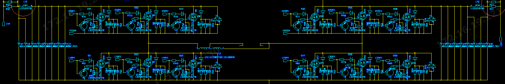
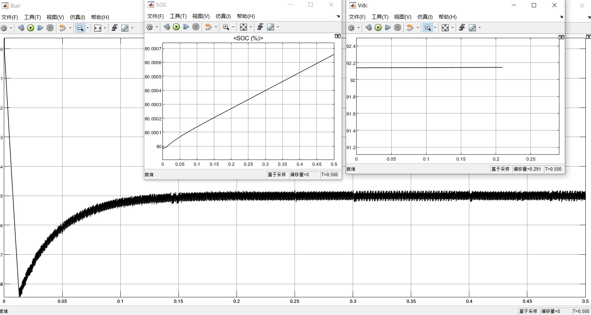
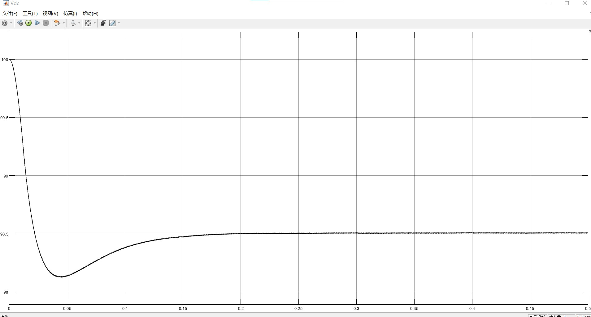
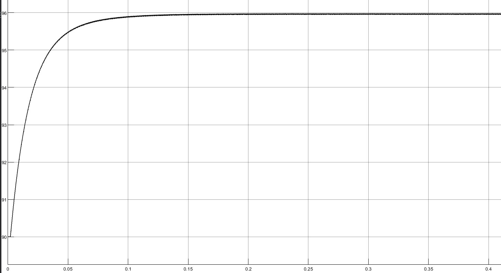
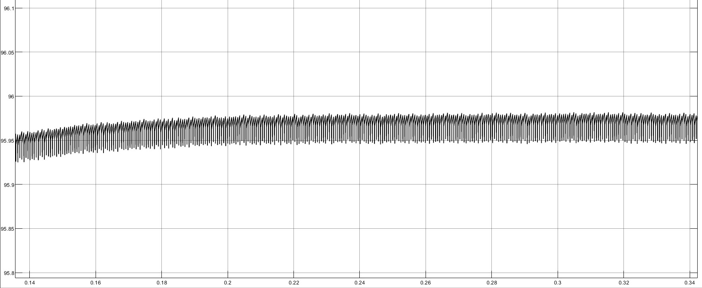
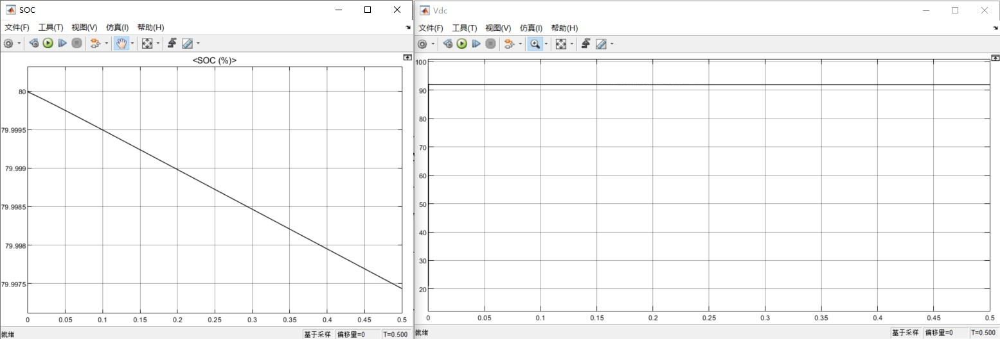

# 锂电池双向充放电

> - :tipping_hand_man:  基本原理和波形的核对，所有的模块双击会有help，可以参考着学习

- 仿真文件

  ```shell
  ./Battery_charge_discharge_ChgDiscModeChange.slx   
  # latest 1.实现双向非隔离DCDC充放电（母线电压闭环方式）
  # 2.手动充放电切换逻辑 + 母线电压稳定
  
  ./Battery_charge_discharge_100ah_only2directionChrgDischarge.mdl
  # 第一版：实现双向充电，无充放电切换逻辑
  
  ./battery_Charg_disCharg_from_DCSource_bidirectionalDCConv.slx
  # rawVersion: 双向非隔离DCDC，只能满足网侧电压 > 电池电压的情况
  
  ./Battery_charge_discharge_FSBB_DCDC.slx
  # 四开关BuckBoost
  ```

- **需求描述 :necktie:**

  > - 电池组参数信息参考
  >   [LFP-100Ah（8S）捆扎模组产品 参考](https://epropulsion.feishu.cn/file/boxcnnuTOKmcj1f6dT2SQ5Kt2rf)
  >   [G102-100 电池文档参考](https://epropulsion.feishu.cn/docx/doxcndgpk2qpBiJfda1Sn7ms5Cc)

  - 基本功能

    现在是微电网项目里面锂电池的一个模块，想要实现 **90kwh（电量，不固定） 的锂电池组模块（100Ah 容量, 102.4V 电压变化范围85-112V， 具体信息参考下面的文档）**，通过**并联多个双向非隔离 dcdc 连到母线（96V）**实现双向充放电的功能。

    - 100Ah 102.4V 锂电池组，组合成 90kwh电池组（目前视为一个整体，组合的话仿真太慢跑不动），这个锂电池组是船上一个动力锂电池。96V/3.2== 30 串
      - 整体电池组 SOC 估计
    - 多个双向非隔离 dcdc：母线电压96V，电池电压 85-115v 需要那种双向 boostbuck 即能升又能降得那种，就是电池电压过低 < 96V 时候，需要母线给电池充电要升压。
    


## DCDC

- 双向非隔离DCDC：实现高斯宝结构的 **H 型全桥-双向非隔离 DCDC**
  就是一个基本的H桥结构，每个开关管由三个并联组合来分流，可以实现电压双极性输出
  
- 测试：控制 dcdc 输出电压，维持电池模块（电池+dcdc）的输出功率恒定3kw～然后测试满充满放


## 充放电的逻辑

> 目前实现了：1.双向充放电；2. 母线电压稳定+超调<1%；3. 满足电池组电压范围 85-112V的充放电
>
> - 参考 "蓄电池闭环设计" [论文参考](https://kns.cnki.net/kcms/detail/detail.aspx?dbcode=CMFD&dbname=CMFD201301&filename=1012520637.nh&uniplatform=NZKPT&v=Q2o1fK-OZQTVxI_t74blb83sWZNr7x297Rrc7ISQ5iWAYGGTKgDmYfauJ5C66CXd)

- 连接方式
  100AH 102.4V的电池模块（用的matlab官方模块）接入一个双向非隔离DCDC连接到母线（仿真里面我视为电压源加上一个负载）
  - 电池参数（使用 Battery mask Matlab官方模块）
    

- 充放电逻辑
  根据**直流母线的电压**来决定电池的充放电 :star: (电压闭环)
  - 直流母线电压 < 96V，电池组给母线充电，满足1）母线电压稳定在96V；2）母线电压的超调<1% （增加了电压源旁边负载电阻的阻值）；3） 输出的电池恒流：保持电流稳定在20A（符合在0-30A了）同时电池因为放电 SOC下降；
  - 母线电压 > 96V ，给电池充电，此时不考虑母线电压的稳定了，就只看电池的电流是否为恒流，此时电流反向为 -5A 给电池充电，电池SOC上升

### 仿真测试

- 验证
  - 双向DC/DC的电流环充放电**恒流模式**
  - 调节**输出电压的电压模式**的功能

#### -5A恒流充电

母线电压100V(>96V)，给电池充电。电池以电流 -5A 进行充电，电压稳定在 92.15V ：电池 SOC 上升，电流恒流



此时的母线一侧电压



#### Mode=3 20A电池恒流放电

母线一侧电压小于96V（使用90V测试）：由蓄电池放电曲线稳定在 96V，超调量<0.5%；电源控制模块：使用 `mode==3` 使用20A恒流放电

- overall
  
- detail
  

- 电池SOC 、电压曲线
  


## 后续优化

该部分锂电池模块，目前实现了基本充放电需求。待连入整体微电网结构，进一步优化，**主要分为两方面的优化：控制策略、拓扑结构**

- 控制策略：目前使用 PI 控制
  - 模糊 PI
  - SMC 滑模控制
  
- 拓扑结构：目前使用非隔离双向DCDC（半桥：2个开关管）
  - 隔离型DCDC（全桥》》4个开关管 + 逆变器）
  
  
  
- **充放电切换：目前为手动模式**，后续与风力发电整体进行联调，修改其切换策略，有了大的整体系统在进行修改。


### QA

- DCDC 

  - 电路里面，电容、电感的值如何选取：**参数根据波形调试，没有啥理论计算**
  - DCDC 结构

  > 双向非隔离型 BuckBoost 电路，Q1Q2互补关系》》输入门信号 S1、S2 互补（方波高低频信号）
  >
  > [参考](https://www.bilibili.com/read/cv12062283)

  这个脉冲信号在充放电两个情况下，后续电压波形就稳定了，脉冲类似。


- `BatteryController` 控制部分

  - **母线电压控制**：输入 96V 期望值，与实际采集到的母线电压，计算误差作为输入

    - PI 控制器参数(经验值)：P 调节快速性（跟踪速度）；I 调节超调量（稳定性）

  - 电流控制：输入蓄电池的电流 Isc，实现电池恒流的要求（否则电池就炸了）

    > :question: 为啥电压误差过 PI 控制的结果，直接可以和 Isc 电池电压比较呢
    >
    > **外环电压环输出的结果是电流环的参考值**>> 参考 **"蓄电池闭环设计"**:star:

  - `PWM` 控制模块：产生高低频脉冲，提供给 DCDC >>`IGBT` 实现充放电
    `Single-phaseHalfBridge(2pulses)`

  

- 三种模式各自功能：**电压电流双闭环，与恒流充放电如何切换呢？**
  **电压电流双闭环（维持母线96V稳定）**、恒流-5A（电池充电）、恒流20A（电池放电）的切换，**具体的切换规则需要看具体场景**：因为实际电网会存在很多情况，比如，切除负荷，单独给蓄电池充电，或者蓄电池检查性放电。

  - 当下只能手动切换，后期放在风力系统可以动态


- 锂电池

  - 电池组内部考虑 SOC均衡
    不建议搞，如果考虑电池内部组合情况，会出现**SOC不均衡环流的情况**，更加难以控制。
    仿真开发周期更长，SOC均衡复杂，且数量越多越复杂。

  - 电池参数

    ```json
    {
        "Type": "Lithium-Ion"  // 磷酸铁锂电池
        "Parameters": {
            "Nominal_Voltage(V)": 85,
        	"Rated_Capacity(Ah)电池额定容量": 100,
        	"Initial_StateOfCharge(%)": 80,  // 电池初始状态 >> 所以额定电压 102V * 0.8 左右
        	"BatteryResponseTime(s)": 30,  // ??
        },
        "Discharge": {
            "MaximumCapacity(Ah)": 107.6923, // ??
            "Cut-off_Voltage(V)": 83.2,
            "FullyChargedCurrent(A)": 20,
            "Internal_resistance(Ohms)": 0.0085,
            "Capacity(Ah)at_nominal_voltage": 96.1538,
            "Exponential_zone[Voltage(V),Capacity(Ah)]": [92.2034, 20],
            "Discharge_characteristics":{
            	"Discharge_current[i1,i2,...]": [6.5, 13, 32.5],
        	}
        }
    }
    ```

    - 标称电压 Nominal_Voltage
    
      理论标称电压为 102.4V，但初始 SOC 设置为 80%，要调整一下。