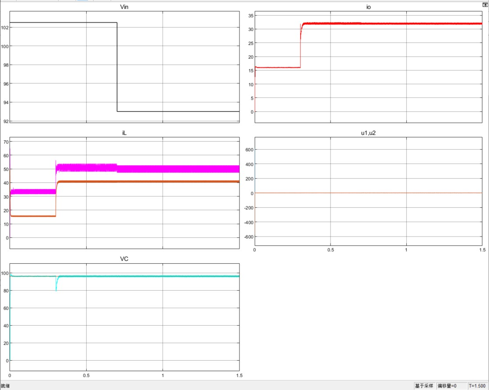
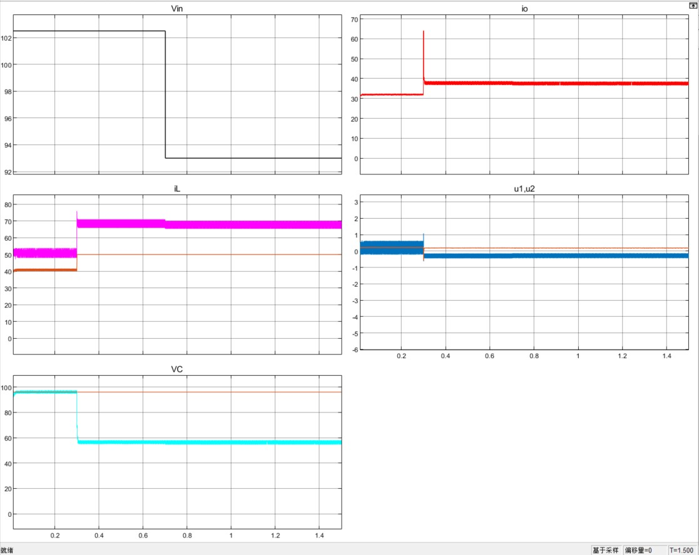
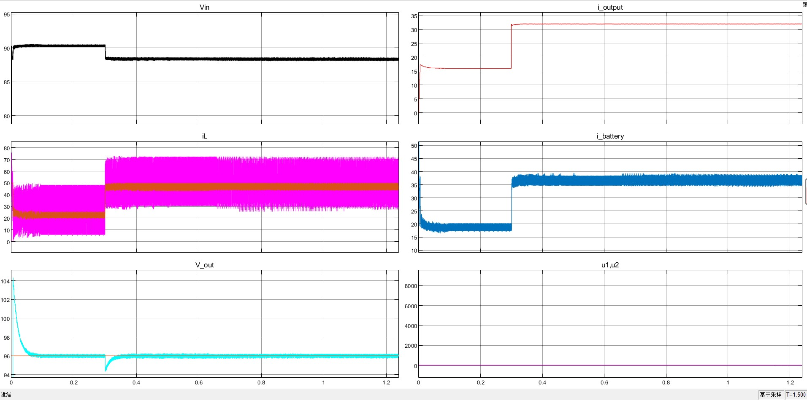
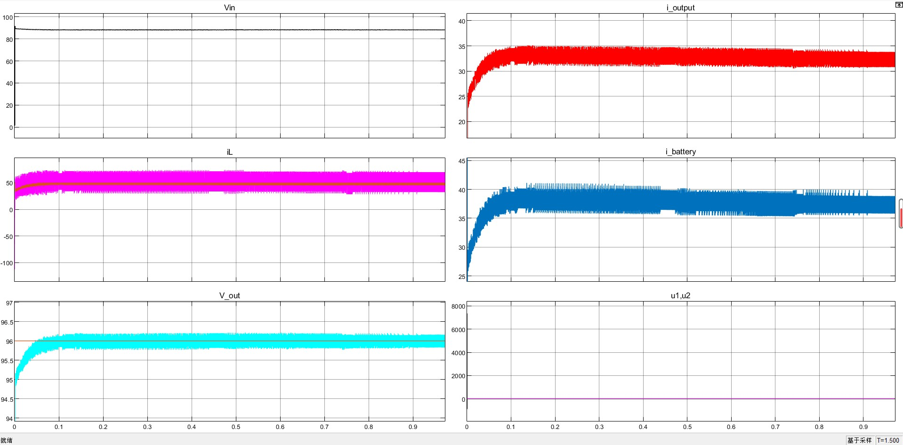
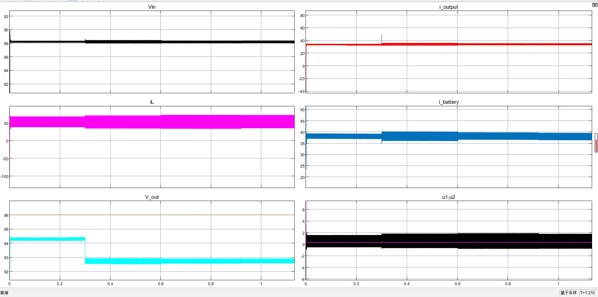
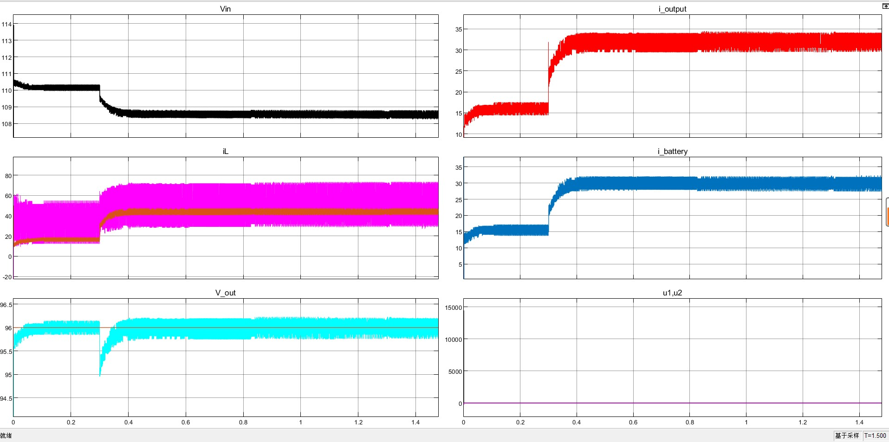
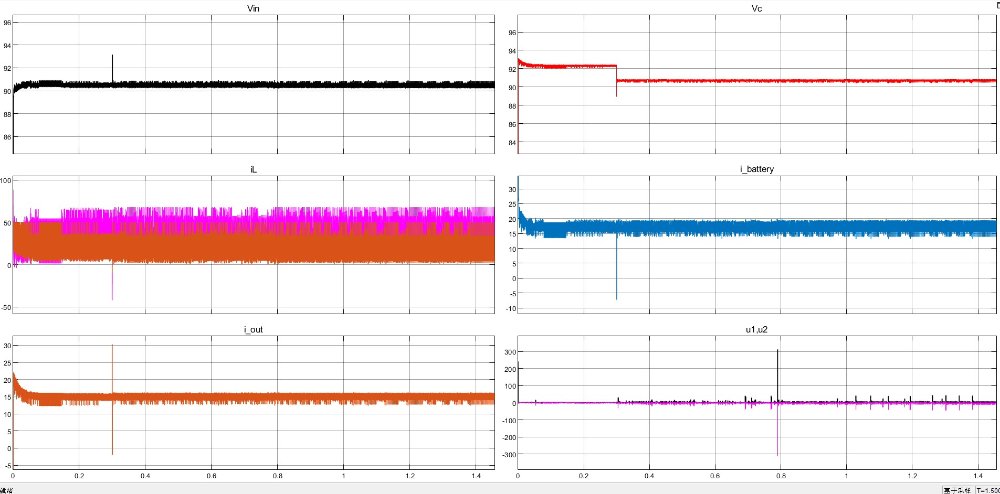
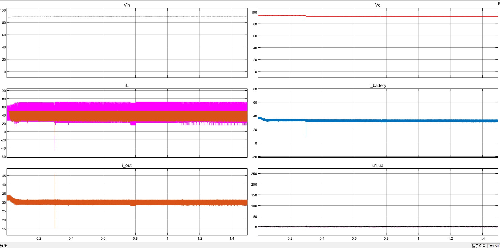
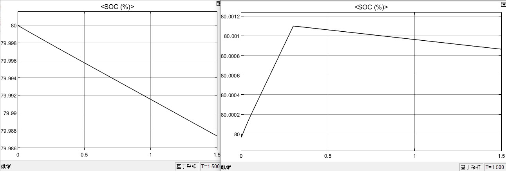

# FSBB_battery_control :zap:

Author `Loki Xun`


## Simulation Target

- 实现基本硬件电路：电池组+双向DCDC

  - 电池组模块： 100ah, 电压范围 85-119V，可实现 SOC 输出

  - 双向非隔离 DC/DC：DC/DC 结构参考高斯宝硬件电路 ，四开关 Buck-Boost，输入输出各8电容(160V,180UF)，开关频率 45k，电感20uh
    


- 控制 dcdc 输出电压，维持电池模块（电池+dcdc）的输出功率恒定3kw
- 测试负载突卸，输出电压是否仍稳定于 96V
- 测试电池满充满放：目前测试方案暂定为，输入电压跳变 102.5V -> 96V


**requirement description:necktie:**

> - 电池组参数信息参考
>   [LFP-100Ah（8S）捆扎模组产品 参考](https://epropulsion.feishu.cn/file/boxcnnuTOKmcj1f6dT2SQ5Kt2rf)
>   [G102-100 电池文档参考](https://epropulsion.feishu.cn/docx/doxcndgpk2qpBiJfda1Sn7ms5Cc)

- 基本功能

  现在是微电网项目里面锂电池的一个模块，想要实现 **90kwh（电量，不固定） 的锂电池组模块（100Ah 容量, 102.4V 电压变化范围85-112V， 具体信息参考下面的文档）**，通过**并联多个双向非隔离 dcdc 连到母线（96V）**实现双向充放电的功能。

  - 100Ah 102.4V 锂电池组，组合成 90kwh电池组（目前视为一个整体，组合的话仿真太慢跑不动），这个锂电池组是船上一个动力锂电池。96V/3.2== 30 串
    - 整体电池组 SOC 估计
  - 多个双向非隔离 dcdc：母线电压96V，电池电压 85-115v 需要那种双向 boostbuck 即能升又能降得那种，就是电池电压过低 < 96V 时候，需要母线给电池充电要升压。


## Setup

> [`gitee` repository](https://gitee.com/tongji620_-group/tongji_micro_grid_program)   [`github` repository](https://github.com/LokiXun/FSBB_DCDC_control_simulation.git):fire:

:warning: This project is programed under `Matlab` (Version: R2022)


## File structure

Whole Project File structure

```shell
|─batteryModeling  # Battery Moudle Simulation
├─batteryModeling_version2017
├─battery_control_combined  # Buck-Boost DCDC + battery (official example)
├─BidirectionalDCDC_BatteryCharge  # FSBB DCDC + battery Simualtion(Main)
│  └─Battery_charge_discharge_ChgDiscModeChange.slx
│  └─Battery_charge_discharge_100ah_only2directionChrgDischarge.mdl
│  └─battery_Charg_disCharg_from_DCSource_bidirectionalDCConv.slx
│  └─Battery_charge_discharge_FSBB_DCDC.slx  # FSBB_simulation (Main Structure)
└─BMS  # Battery Management System Simulation(official example)
```


For `BidirectionalDCDC_BatteryCharge` Module

```shell
# base_path = "LithiumIonBattery/BidirectionalDCDC_BatteryCharge"

./Battery_charge_discharge_ChgDiscModeChange.slx   
# 1.实现双向 Buck-Boost(非隔离)DCDC充放电（母线电压闭环方式）
# 2.手动充放电切换逻辑 + 母线电压稳定

./Battery_charge_discharge_100ah_only2directionChrgDischarge.mdl
# 第一版：实现双向充电，无充放电切换逻辑

./battery_Charg_disCharg_from_DCSource_bidirectionalDCConv.slx
# rawVersion: 双向非隔离DCDC，只能满足网侧电压 > 电池电压的情况

./Battery_charge_discharge_FSBB_DCDC.slx
# 四开关BuckBoost: 实现四开关 buck-boost
./Battery_charge_discharge_FSBB_param_init.m  # (used for initialization)
```


## Bi-direction buck-boost

> 目前实现了：1.双向充放电；2. 母线电压稳定+超调<1%；3. 满足电池组电压范围 85-112V的充放电
>
> - 参考 "蓄电池闭环设计" [论文参考](https://kns.cnki.net/kcms/detail/detail.aspx?dbcode=CMFD&dbname=CMFD201301&filename=1012520637.nh&uniplatform=NZKPT&v=Q2o1fK-OZQTVxI_t74blb83sWZNr7x297Rrc7ISQ5iWAYGGTKgDmYfauJ5C66CXd)

- 连接方式
  100AH 102.4V的电池模块（用的matlab官方模块）接入一个双向非隔离DCDC连接到母线（仿真里面我视为电压源加上一个负载）
  - 电池参数（使用 Battery mask Matlab官方模块）
    

- 充放电逻辑
  根据**直流母线的电压**来决定电池的充放电 :star: (电压闭环)
  - 直流母线电压 < 96V，电池组给母线充电，满足1）母线电压稳定在96V；2）母线电压的超调<1% （增加了电压源旁边负载电阻的阻值）；3） 输出的电池恒流：保持电流稳定在20A（符合在0-30A了）同时电池因为放电 SOC下降；
  - 母线电压 > 96V ，给电池充电，此时不考虑母线电压的稳定了，就只看电池的电流是否为恒流，此时电流反向为 -5A 给电池充电，电池SOC上升

### 仿真测试

- 验证
  - 双向DC/DC的电流环充放电**恒流模式**
  - 调节**输出电压的电压模式**的功能

#### -5A恒流充电

母线电压100V(>96V)，给电池充电。电池以电流 -5A 进行充电，电压稳定在 92.15V ：电池 SOC 上升，电流恒流


此时的母线一侧电压


#### Mode=3 20A电池恒流放电

母线一侧电压小于96V（使用90V测试）：由蓄电池放电曲线稳定在 96V，超调量<0.5%；电源控制模块：使用 `mode==3` 使用20A恒流放电

- overall
  
- detail
  

- 电池SOC 、电压曲线
  


## FSBB  :crossed_swords:

> referenced paper:  [Passivity Based Control of Four-Switch Buck-Boost DC-DC Converter without Operation Mode Detection](https://ieeexplore.ieee.org/document/9968779) 
> [paper's youtube video tutorial](https://www.youtube.com/watch?v=5YT7cERlMrg) :honey_pot:
>
> 仿真文件 `path = LithiumIonBattery/BidirectionalDCDC_BatteryCharge/Battery_charge_discharge_FSBB_DCDC.slx`

### TODO :turtle:

- 充放电模块功能测试

  - [x] 搭建硬件类似拓扑，实现恒压、恒流、恒功率模块

    - [x] 修复输出端串联 96V 电压源 +  电阻，恒压模式下在负载突卸时，电压突降赋值太大。

  - [x] 恒流纹波太大

    **调整电路拓扑**，在输入输出增加差模电感，配合 PI 控制，降低电流纹波

    - [x] 调整恒压模块 `u1,u2` 推导公式，目前用的简化版本方式，效果可以
      1. 简化版本：用一个差模电感代替输入输出的两个查谟电阻
      2. 精确版本：公式中输入端的差模电感组合 u1，输出端差模电感组合 u2，更新 u1，u2 的计算公式

  - [x] 充电模式切换

    参考高斯宝规格书，实现恒流-恒功率切换

    - [x] 电压在103.5V零界点切换存在问题，电压波动剧烈，从而造成恒功率失效，电流的参考值根据 U 计算出来也会波对剧烈

      恒流恒功率 分成了 2 个 if-then 模块，里面的 matlab_function 计算导数会用到上一次的值，若频繁切换会使得导数计算错误，导致失效。由于恒流恒功率都用的是 `恒流模块` 实现，因此合并成一个 if-then 模块，里面用 switch 选择恒流 or 恒功率的参考电流值，来作为 PI 的输入

  - [x] 放电模式切换

  - [ ] 满充-满放-满充测试

    - [ ] 恒流放电模式下负载跳变、外部电压跳变时，电流跳变过大
      - [ ] 模仿实际硬件通过调节输出电压来实现，恒流点过压保护 3.22
      - [ ] 调研双闭环控制方式
  
- 模块封装

  - [x] 整合充电、放电模块，使用 2 个标志位进行手动切换

    使用 `simulink if-then` 模块


### Topology


- 待调整参数 

  >  目前不确定如何调整此参数 :question:

  ```shell
  P, I  # PI 模块
  C, L, R_L  # 电容电感参数计算
  saturation_range  # u1, u2 控制信号饱和环接参数
  triangular_wave_frequency  # 三角波频率
  z1, z2  # dumping_gains
  ```

- 存在问题

  使用 switch 实现 if-else 的问题：咨询了一个电网里面做仿真的朋友，说这种需要切换状态的四开关buckBoost 不好实现，matlab里面仿真延迟很严重，会存在上个状态还没切换完成，实际变换到下一个状态的情况，他了解的都是把模式拆看单独看，每次只验证一种buck 或者 boost的情况。


### 论文复现

仿真1.5s，$V_{in}$ 输入电压（电池一侧）初始24V，0.7s 跳变至 36V。输出参考电压 24V。负载初始 10Ω，0.4s时负载突卸，降至5Ω。

- 开关间接控制信号 $u_1, u_2$ 未使用饱和环接
  

- 使用 [-1, 1] 的饱和环接：效果类似
  


### Constant Voltage

> **负载的初始大小**对仿真结果，Vc 输出电压结果的赋值影响很大

- 电池 102.5 -> 93V （0.7s）; **0.4s 负载跳变从 6Ω-> 3Ω**，Vc=96V；PI、电容等参数使用论文中的值
  
  
- 电池 102.5 -> 93V （0.7s）**; 0.4s 负载跳变从 3Ω-> 1.5Ω**，Vc=96V；PI、电容等参数使用论文中的值
  
  
  

- 电容、电感更改为高斯宝提供参数

  > - 高斯宝：输入输出各8电容(160V,180UF)，开关频率 45k，电感20uh；
  > - 目前拓扑存在差异，**仅使用输出并联 8 个电容（使用一个电容 1440e-6代替），电感20uh**，开关频率使用 10k（45k仿真速度太慢）

#### Sudden Load drop

修改参数后，实现电压突变 < 2%

```shell
P=15, I=1000  # PI 模块
C_motherLine=1440e-6, L=20e-6, R_L=0.004  # 电容电感参数计算
saturation_range=None "not used"  # u1, u2 控制信号饱和环接参数
triangular_wave_frequency=45e3  # 三角波频率
z1=6, z2=0.08  # dumping_gains
```


**恒压放电**

- 输出端仅连接负载，0.3s负载突加 6ohm -》3ohm

- 输出端连接：SOC=80% 的电池模块
  
- 输出连接电池 + 负载（0.3s 负载突加）
  

- 输出连接 96V 电压源 + 负载（0.3s 负载突加）
  


### Constant Current

目标效果：能够实现 dcdc 恒流输出，恒流给电池充电

- 期望的输出电流值（恒流）i_out_ref = 15A，dcdc 恒流输出，0.3s 负载突加（6Ω，再并联一个 6Ω）
  

- 期望的输出电流值（恒流）i_out_ref = 30A，dcdc 恒流输出，0.3s 负载突加（6Ω，再并联一个 6Ω）

  给外部电池充电
  

  电池 SOC 变化情况：左侧为 dcdc 内部电池，右侧为输出端连接的电池。0.3s 之前恒流充电，之后突加负载（并联一个 6ohm）

  


- :question: 观察恒流模式下，电池电压在 0s 刚启动的时候接近 0，电流接近-8000
  

- 规格书中的`电流设置精度`

  给电池恒流充电，充电电流是50A，而我的电源检测的电流也是50A，这就是没有误差，如果我上报是51A就代表有1A的误差

- :question: 恒流模式下，电流纹波太大，接近2A

  电流纹波在电感上产生的，取决于电感电流 $\triangle{}I$ 的变化量，加大电感或者开关频率会有改善。电源规格书都没有电流纹波这个东西


#### Lower Current oscillation

**根据实际电路修改拓扑，在输入输出端增加两个$2.2e-6H$ 的差模电阻 **


```shell
45e3  # 开关频率 Hz
20e-6  # 主电感 H
2.2e-6  # 差模电感 H

```


增大主电感至 $40e-6 H$，输出电流纹波略微减小


80e-6 H 主电感 + 100hz


### Constant Power

恒功率，使用电流恒流实现。对于某一时刻的电流参考值，根据当前输出电压计算出来  $I_{ref}= P / U_{out}$。

```shell
45kHz  # 开关频率
40e-6H  # 主电感
2.2e-6H  # 输入输出端的差模电感
```


**Battery discharge**


负载突卸时的功率曲线


**charge Battery**


### Test

恒流、恒功率切换硬件实现

DCDC 内部电路拓扑


输出端拓扑


**单个模式下测试负载跳变**

1. 放电模式下，输出端并联 104V 电压源，再并联 6ohm 负载，在 0.5s 突加 6ohm 的负载

   功率跳变太大，电流反向了 :shit:

2. 输出端接 96V 电压源， 0.5s 突加 6ohm 的负载

   

> **电流跳变太大原因**：**电感电流变化没有控制**，目前只有外环控制（控制输出端电流），增加双闭环结构试试看


## Later improvement

该部分锂电池模块，目前实现了基本充放电需求。待连入整体微电网结构，进一步优化，**主要分为两方面的优化：控制策略、拓扑结构**

- 控制策略：目前使用 PI 控制
  - 模糊 PI
  - SMC 滑模控制
- 拓扑结构：目前使用非隔离双向DCDC，更新为隔离型DCDC
- **充放电切换逻辑：目前为手动模式**，后续与风力发电整体进行联调，修改其切换策略，有了大的整体系统在进行修改。


### QA

- 恒压无法稳定在参考值？
  调整电池串联的电阻，或者母线电压源串联的电阻，电阻太小分压不够

- DCDC 电路里面，电容、电感的值如何选取：**参数根据波形调试**


- `BatteryController` 控制部分

  - **母线电压控制**：输入 96V 期望值，与实际采集到的母线电压，计算误差作为输入

    - PI 控制器参数(经验值)：P 调节快速性（跟踪速度）；I 调节超调量（稳定性）

  - 电流控制：输入蓄电池的电流 Isc，实现电池恒流的要求（否则电池就炸了）

    > :question: 为啥电压误差过 PI 控制的结果，直接可以和 Isc 电池电压比较呢
    >
    > **外环电压环输出的结果是电流环的参考值**>> 参考 **"蓄电池闭环设计"**:star:

  - `PWM` 控制模块：产生高低频脉冲，提供给 DCDC >>`IGBT` 实现充放电
    `Single-phaseHalfBridge(2pulses)`

  

- if-Block

  > [参考](https://ww2.mathworks.cn/help/simulink/slref/if.html)

  The If block, along with [If Action Subsystem](https://ww2.mathworks.cn/help/simulink/slref/ifactionsubsystem.html) blocks that contain an [Action Port](https://ww2.mathworks.cn/help/simulink/slref/actionport.html) block, implements if-else logic to control subsystem execution.

  - output

    `Action` — Action signal for an If Action Subsystem block

    Outputs from the `if`, `else`, and `elseif` ports are **action signals** to If Action Subsystem blocks.

  **merge**

  用于将多个 `if-action` 的 output 同一变量结果合并，merge 模块使**用最新更新的数据**。
  The output value at any time is equal to the **most recently computed output** of its driving blocks.

  - :question: Do not branch a signal that is input to a Merge block.
    要输入 merge 的信号不可以分支用到别的地方。PWM信号发生器里面 u1, u2 取反的关系，不能直接将 u1，u2 连到各自的 merge。

    If a signal line goes to a Merge block, this signal line can't go anywhere else (branched). If you really need to use this signal line somewhere else, insert a **Signal Conversion block**  and set it to do "Signal Copy".  没用。。

    [Solution ref](https://ww2.mathworks.cn/en/support/search.html/answers/1699700-branched-signals-cannot-be-fed-into-a-merge-block.html?fq%5B%5D=asset_type_name:answer&fq%5B%5D=category:simulink/sources&page=1)

  

  **sample time mismatch**

  > [参考](https://ww2.mathworks.cn/help/simulink/slref/ratetransition.html)

  integrator 模块 sample_time=0, 和 if-block 5e-6 不一致。在 if-block 输入地方采样时间加上 `Rate Transition Block` 使得其也变成0

  

  **Limitations**

  1. Values for an `if` or `elseif` expression cannot be tuned during a simulation in normal or accelerator mode
  2. It does not support custom storage classes.

  


- 锂电池

  - 电池组内部考虑 SOC均衡
    咨询电网仿真工作人员，说不建议搞，如果考虑电池内部组合情况，会出现**SOC不均衡环流的情况**，更加难以控制。仿真开发周期更长，SOC均衡复杂，且数量越多越复杂。
    
  - 电池参数
  
    ```json
    {
        "Type": "Lithium-Ion"  // 磷酸铁锂电池
        "Parameters": {
            "Nominal_Voltage(V)": 85,
        	"Rated_Capacity(Ah)电池额定容量": 100,
        	"Initial_StateOfCharge(%)": 80,  // 电池初始状态 >> 所以额定电压 102V * 0.8 左右
        	"BatteryResponseTime(s)": 30,  // ??
        },
        "Discharge": {
            "MaximumCapacity(Ah)": 107.6923, // ??
            "Cut-off_Voltage(V)": 83.2,
            "FullyChargedCurrent(A)": 20,
            "Internal_resistance(Ohms)": 0.0085,
            "Capacity(Ah)at_nominal_voltage": 96.1538,
            "Exponential_zone[Voltage(V),Capacity(Ah)]": [92.2034, 20],
            "Discharge_characteristics":{
            	"Discharge_current[i1,i2,...]": [6.5, 13, 32.5],
        	}
        }
    }
    ```
  
    - 标称电压 Nominal_Voltage
    
      理论标称电压为 102.4V，但初始 SOC 设置为 80%，要调整一下。
