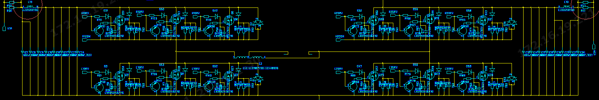
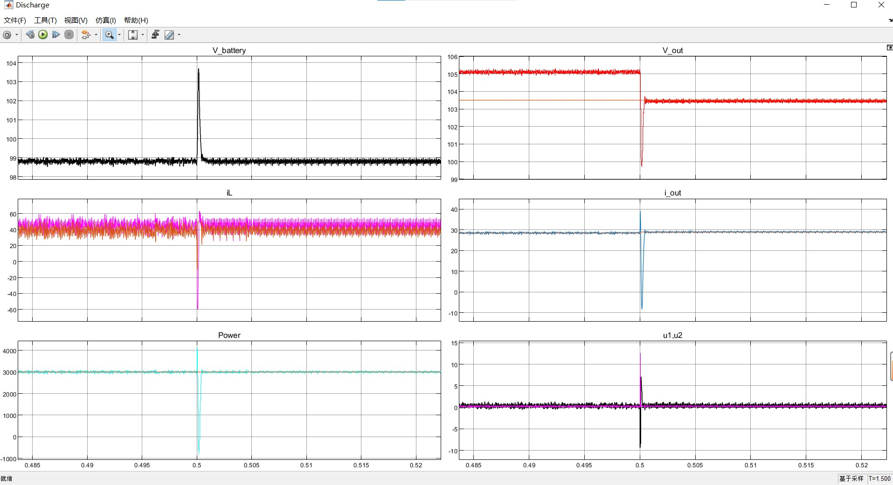
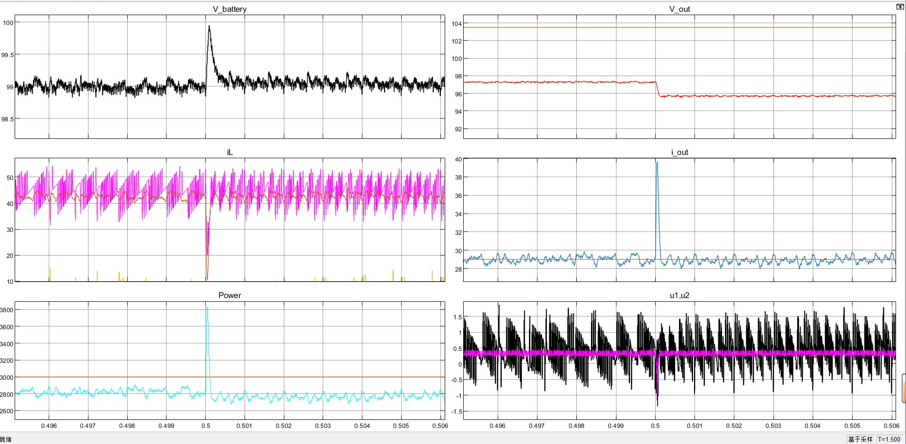

# FSBB_battery_control :zap:

Author `Loki Xun`


## Simulation Target

- 实现基本硬件电路：电池组+双向DCDC

  - 电池组模块： 100ah, 电压范围 85-119V，可实现 SOC 输出

  - 双向非隔离 DC/DC：DC/DC 结构参考高斯宝硬件电路 ，四开关 Buck-Boost，输入输出各8电容(160V,180UF)，开关频率 45k，电感20uh


- 控制 dcdc 输出电压，维持电池模块（电池+dcdc）的输出功率恒定3kw
- 测试负载突卸，输出电压是否仍稳定于 96V
- 测试电池满充满放：目前测试方案暂定为，输入电压跳变 102.5V -> 96V


**requirement description:necktie:**

> - 电池组参数信息参考
>   [LFP-100Ah（8S）捆扎模组产品 参考](https://epropulsion.feishu.cn/file/boxcnnuTOKmcj1f6dT2SQ5Kt2rf)
>   [G102-100 电池文档参考](https://epropulsion.feishu.cn/docx/doxcndgpk2qpBiJfda1Sn7ms5Cc)

- 基本功能

  现在是微电网项目里面锂电池的一个模块，想要实现 **90kwh（电量，不固定） 的锂电池组模块（100Ah 容量, 102.4V 电压变化范围85-112V， 具体信息参考下面的文档）**，通过**并联多个双向非隔离 dcdc 连到母线（96V）**实现双向充放电的功能。

  - 100Ah 102.4V 锂电池组，组合成 90kwh电池组（目前视为一个整体，组合的话仿真太慢跑不动），这个锂电池组是船上一个动力锂电池。96V/3.2== 30 串
    - 整体电池组 SOC 估计
  - 多个双向非隔离 dcdc：母线电压96V，电池电压 85-115v 需要那种双向 boostbuck 即能升又能降得那种，就是电池电压过低 < 96V 时候，需要母线给电池充电要升压。


## Setup

> [`gitee` repository](https://gitee.com/tongji620_-group/tongji_micro_grid_program)   [`github` repository](https://github.com/LokiXun/FSBB_DCDC_control_simulation.git):fire:

:warning: This project is programed under `Matlab` (Version: R2022)


## File structure

Whole Project File structure

```shell
|─batteryModeling  # Battery Moudle Simulation
├─batteryModeling_version2017
├─battery_control_combined  # Buck-Boost DCDC + battery (official example)
├─BidirectionalDCDC_BatteryCharge  # FSBB DCDC + battery Simualtion(Main)
│  └─Battery_charge_discharge_ChgDiscModeChange.slx
│  └─Battery_charge_discharge_100ah_only2directionChrgDischarge.mdl
│  └─battery_Charg_disCharg_from_DCSource_bidirectionalDCConv.slx
│  └─Battery_charge_discharge_FSBB_DCDC.slx  # FSBB_simulation (Main Structure)
└─BMS  # Battery Management System Simulation(official example)
```


For `BidirectionalDCDC_BatteryCharge` Module

```shell
# base_path = "LithiumIonBattery/BidirectionalDCDC_BatteryCharge"

./Battery_charge_discharge_ChgDiscModeChange.slx   
# 1.实现双向 Buck-Boost(非隔离)DCDC充放电（母线电压闭环方式）
# 2.手动充放电切换逻辑 + 母线电压稳定

./Battery_charge_discharge_100ah_only2directionChrgDischarge.mdl
# 第一版：实现双向充电，无充放电切换逻辑

./battery_Charg_disCharg_from_DCSource_bidirectionalDCConv.slx
# rawVersion: 双向非隔离DCDC，只能满足网侧电压 > 电池电压的情况

./Battery_charge_discharge_FSBB_DCDC.slx
# 四开关BuckBoost: 实现四开关 buck-boost
./Battery_charge_discharge_FSBB_param_init.m  # (used for initialization)
```


## Bi-direction buck-boost

> 目前实现了：1.双向充放电；2. 母线电压稳定+超调<1%；3. 满足电池组电压范围 85-112V的充放电
>
> - 参考 "蓄电池闭环设计" [论文参考](https://kns.cnki.net/kcms/detail/detail.aspx?dbcode=CMFD&dbname=CMFD201301&filename=1012520637.nh&uniplatform=NZKPT&v=Q2o1fK-OZQTVxI_t74blb83sWZNr7x297Rrc7ISQ5iWAYGGTKgDmYfauJ5C66CXd)

- 连接方式
  100AH 102.4V的电池模块（用的matlab官方模块）接入一个双向非隔离DCDC连接到母线（仿真里面我视为电压源加上一个负载）
  - 电池参数（使用 Battery mask Matlab官方模块）
    

- 充放电逻辑
  根据**直流母线的电压**来决定电池的充放电 :star: (电压闭环)
  - 直流母线电压 < 96V，电池组给母线充电，满足1）母线电压稳定在96V；2）母线电压的超调<1% （增加了电压源旁边负载电阻的阻值）；3） 输出的电池恒流：保持电流稳定在20A（符合在0-30A了）同时电池因为放电 SOC下降；
  - 母线电压 > 96V ，给电池充电，此时不考虑母线电压的稳定了，就只看电池的电流是否为恒流，此时电流反向为 -5A 给电池充电，电池SOC上升

### 仿真测试

- 验证
  - 双向DC/DC的电流环充放电**恒流模式**
  - 调节**输出电压的电压模式**的功能

#### -5A恒流充电

母线电压100V(>96V)，给电池充电。电池以电流 -5A 进行充电，电压稳定在 92.15V ：电池 SOC 上升，电流恒流


此时的母线一侧电压


#### Mode=3 20A电池恒流放电

母线一侧电压小于96V（使用90V测试）：由蓄电池放电曲线稳定在 96V，超调量<0.5%；电源控制模块：使用 `mode==3` 使用20A恒流放电

- overall
  
- detail
  

- 电池SOC 、电压曲线
  


## FSBB  :crossed_swords:

> 仿真文件 `path = LithiumIonBattery/BidirectionalDCDC_BatteryCharge/Battery_charge_discharge_FSBB_DCDC.slx`

### TODO :turtle:

- 充放电模块功能测试

  - [x] 搭建 FSBB 拓扑，实现恒压、恒流、恒功率模块

    - [x] 输出端只有负载的情况下，实现恒流、恒压
    - [x] 修复输出端串联 96V 电压源 +  电阻，恒压模式下在负载突卸时，电压突降赋值太大。
  
  - [x] 恒流纹波太大
  
    **调整电路拓扑**，在输入输出增加差模电感，配合 PI 控制，降低电流纹波
  
    - [x] 调整恒压模块 `u1,u2` 推导公式，目前用的简化版本方式，效果可以
      1. 简化版本：用一个差模电感代替输入输出的两个查谟电阻
      2. 精确版本：公式中输入端的差模电感组合 u1，输出端差模电感组合 u2，更新 u1，u2 的计算公式
  
  - [x] 充电/放电下，恒流、恒功率模式切换
  
    参考高斯宝规格书，实现恒流-恒功率切换
  
    - [x] 电压在103.5V零界点切换存在问题，电压波动剧烈，从而造成恒功率失效，电流的参考值根据 U 计算出来也会波对剧烈
  
      恒流恒功率 分成了 2 个 if-then 模块，里面的 matlab_function 计算导数会用到上一次的值，若频繁切换会使得导数计算错误，导致失效。由于恒流恒功率都用的是 `恒流模块` 实现，因此合并成一个 if-then 模块，里面用 switch 选择恒流 or 恒功率的参考电流值，来作为 PI 的输入
  
  - [x] 负载跳变测试
  
    - [x] 仿真起始的电池电压从 0 开始上升，导致放电起始电流反向
  
      电池并联了电容，电容设置初始电压即可
  
    - [x] 沟通高斯宝硬件技术，测试的外部拓扑是否正确
  
      1. DCDC电源模块放电，**外部只用可调负载来模拟母线**，电池向外输出 96V
      2. DCDC 电源模块充电，把电池当作负载（电池有变动的阻值）
      3. 控制方式：可调节电压（恒压）来实现恒流，恒功率；恒压控制时候一边的管子常开，另一边根据输出电压调整占空比
  
    - [x] 咨询使用环境，测试拓扑
  
      外部要并联电压源 + 并联负载
  
    - [ ] ~~恒流放电模式下负载跳变、外部电压跳变时，电流跳变过大~~
  
      目前放电模式只使用恒压稳定 96V 即可。
  
      实际硬件恒流模式的控制方式，设置额定电压，在正常带载的情况下进性恒压控制。随着负载满载or超载 （外部等效电阻，阻值减小），电流持续升高，达到29A恒流点。此时根据 $I = U / R$，外部电阻阻值 R 减小 ，降低电压的参考值 U，即通过恒压方式来实现恒流。
  
    - [ ] 空载，满载切换，电压跳变太大
  
      - [x] 测试 PI 参数
      - [x] 测试阻尼比
      - [ ] 检测负载跳变，加入优化条件：增加一个gain
  
    - [ ] 更换控制方式
  
      - [ ] 模型选型
  
  - [ ] 充放电切换测试
  
    - [ ] 实现恒流、恒压模式切换
  
  - [ ] 实现过压、欠压保护
  
    （硬件实现）电流过大，I = U/R, 降低电压，如果电压低于保护点，把 4 个驱动输出 0 （驱动直接关掉），然后需要手动指令去恢复
  
- 优化项

  - [x] modify the PI by `The Ziegler–Nichols Method`
  - [ ] 调研双闭环控制方式
  
- 模块封装

  - [x] 整合充电、放电模块，使用 2 个标志位进行手动切换

    使用 `simulink if-then` 模块


### Topology + Param

**Hardware Topology**



**Simulation Topology**


- Model Parameters

  ```shell
  # FSBB param
  wave_freq = 45e3  # 开关频率 Hz
  mid_L = 40e-6  # 主电感 H
  mid_R = 0.004  # 主电感旁边的电阻 Ohms
  
  DM_inductor1 = 2.2e-6  # 差模电感 H battery_side
  DM_inductor2 = 2.2e-6  # ~ bus_side
  C1 = 1440e-6  # battery side parallel capacitor (Farad)
  C2 = 1440e-6
  
  # battery
  R_battery = 0.1 # Battery_inside_resistance Ohms (connect in series)
  
  ```

Gospower 硬件输入输出各8电容(160V,180UF)，开关频率 45k，电感 20uh。目前仿真内部，**使用一个电容 1440e-6 F 代替并联的 8 个电容**


### model selection

1. Passivity Based Control of Four-Switch Buck-Boost DC-DC Converter without Operation Mode Detection

For single loop module controlling the output voltage, the mid_inductor's current can not balance well. And this cause the giant voltage ripple in changing from 0->100% load.
选择双闭环结构模型，对内环电感电流进行控制。

1. [Four-Switch Buck–Boost Converter Based on Model Predictive Control With Smooth Mode Transition Capability](https://ieeexplore.ieee.org/document/9219154)


### Reproduce paper

> - KCL(Kirchhoff's Current Law)
>
>   Total current entering a junction is equal to total current leaving it
>
> - KVL(Kirchhoff's Voltage Law)
>
>   Algebraic sum of voltages around a loop equals to zero.

**Passivity Based Control of Four-Switch Buck-Boost DC-DC Converter without Operation Mode Detection**

- **The passivity based control** is formulated  that targets to drive the inductor current and capacitor voltage to  their reference values.
- eliminates the need for  using a buck or boost mode detection algorithm

**The control input equations are  determined separately so as to obtain the duty cycle** of buck and  boost stages. The approximate values of damping gains are  determined analytically which are useful in designing the  converter for different operating points. While the load voltage  (capacitor voltage) is controlled by a PI regulator, the passivity  based control achieves the control of inductor current. The  switching signals are produced by comparing the duty cycles  with a triangular carrier. **An important advantage of the  proposed control approach is that it does not need any mode  transition (or detection) algorithm which leads to simplicity  compared with the existing control approaches.**

> [referenced paper](https://ieeexplore.ieee.org/document/9968779) 
> [paper's youtube video tutorial](https://www.youtube.com/watch?v=5YT7cERlMrg) :honey_pot:
>
> 外环电压环输出的结果是电流环的参考值**>> 参考 **"蓄电池闭环设计":star:

仿真实现简单，能够满足基本要求。但只有单个环路控制，外环输出的 `iL` 电感电流使用增加阻尼比的方式进性调节，未使用内环控制。


仿真1.5s，$V_{in}$ 输入电压（电池一侧）初始24V，0.7s 跳变至 36V。输出参考电压 24V。负载初始 10Ω，0.4s时负载突卸，降至5Ω。

- 开关间接控制信号 $u_1, u_2$ 未使用饱和环接
  

- 使用 [-1, 1] 的饱和环接：效果类似
  


### Constant Current

> - 规格书中的`电流设置精度`
>
>   给电池恒流充电，充电电流是50A，而我的电源检测的电流也是50A，这就是没有误差，如果我上报是51A就代表有1A的误差
>
> - 恒流模式下，电流纹波影响因素
>
>   电流纹波在电感上产生的，取决于电感电流 $\triangle{}I$ 的变化量，加大电感或者开关频率会有改善。电源规格书都没有电流纹波这个东西
>
> :warning: 目前需求是保持母线输出 96V，恒流模式可用于电池充电

- 测试目标
  1. 能够实现 dcdc 恒流输出
  2. 恒流给电池充电

**Lower oscillation**

- :grey_question: 电池电压在 0s 刚启动的时候接近 0，电流接近-8000
  
  通过设置电感初始电压解决
  
  
  
  
  
- 根据实际电路修改拓扑，在输入输出端增加两个$2.2e-6H$ 的差模电阻 


- 增大主电感

增大主电感至 $40e-6 H$，输出电流纹波略微减小


80e-6 H 主电感 + 100hz


**恒流模式下，测试负载跳变**

1. 在 85.85 -> 101 V 为恒流模式

   满载电流= 29A，25% 负载是 I * 0.25，电流可以在 0 - 29A 范围内变化，恒流固定在一个值就行。  需要固定一个电压值，然后满载电阻就是 $R = \frac{U}{30}$ , 25% 负载是指 电流25%的情况下的电阻, $R * 4 =  U/ {(30*0.25)}$。

   ```shell
   Voltage_current_mode = 96;
   Current_100 = 29;
   load_percent_list =
   
       0.2500    0.5000    0.7500    1.0000
   
   R_current_mode_load_change =
   
      13.2414    6.6207    4.4138    3.3103
   
   I_current_mode_load_change =
   
       7.2500   14.5000   21.7500   29.0000
   ```

2. 101 -> 116.15 V 恒功率模式

   满载功率 3kW, $R = U^2 / P$ 

   ```shell
   Voltage_power_mode = 105;
   P_100 = 3000;
   load_percent_list =
   
       0.2500    0.5000    0.7500    1.0000
   
   Power_power_mode_load_change =
   
            750        1500        2250        3000
   
   R_power_mode_load_change =
   
      14.7000    7.3500    4.9000    3.6750
   ```


1. 放电模式下，输出端并联 104V 电压源，再并联 6ohm 负载，在 0.5s 突加 6ohm 的负载

   功率跳变太大，电流反向了 :shit:

2. 输出端接 96V 电压源， 0.5s 突加 6ohm 的负载

   

> **电流跳变太大原因分析**
>
> 1. **电感电流变化没有控制**，目前只有外环控制（控制输出端电流），增加双闭环结构试试看
>
> 2. 目前控制方式输出 u1，u2 控制信号与 V_in, V_out, iL_ref 有关，
>
>    尝试调整阻尼系数
>
>    $iL_{ref} = (iL_{ref} - iL_{ref_{old}}) / Ts$
>    ${Vc_{ref}}^` = (Vc - Vc_{old}) / Ts$

**调节外环控制的 PI 参数**

> [如何调节 PI 参数](https://zhuanlan.zhihu.com/p/99922166)

1. 比例系数 `Kp`
   三个参数中的绝对主力，不可或缺。`Kp` 增大可以加快系统响应，减小静差，但系统超调量会加大，稳定性变差。比例控制是一种立即控制，只要有偏差，就立即输出控制量。大部分系统只需要 P 控制即可实现基本的稳快准需求。

2. 积分系数 `Ki`

   三个参数中的一般主力，用于消除静差、*Ki 减小可以降低超调量，使系统的稳定性增强*。积分控制是一种修复控制，只要有偏差，就会逐渐去往消除偏差的方向去控制。

因此为了使得电感电流变化没那么快，降低 Kp 增大 Ki

****

```shell
p = 15 / 10
I = 1000 * 10
```

电感电流（`iL` 紫色线）实际值在负载跳变时，未跟踪 `iL_ref`，此种情况电流突降幅度缓解。


**调整控制模块的阻尼系数**

```matlab
P = 15;
I = 1000;
zeta1 = 6*2;  % dumping gains
zeta2 = 0.08*10;
```


电流纹波减小 $\triangle{I} < 0.5A$

```matlab
P = 15/3;
I = 1000;
zeta1 = 6*2;  % dumping gains
zeta2 = 0.08*10;
```




### Constant Power

恒功率，使用电流恒流实现。对于某一时刻的电流参考值，根据当前输出电压计算出来  $I_{ref}= P / U_{out}$。


**Battery discharge**


负载突卸时的功率曲线


**charge Battery**


### Constant Voltage :+1:

- 测试目标
  1. 放电：恒压输出 96 V，测试 25%-50%，50%-75% 的负载跳变

- Parameter

  ```shell
  P = 15 * 2
  I = 1000
  
  # control strategy
  zeta1 = 6 * 4
  zeta2 = 0.08 * 2
  
  # u1, u2 saturation
  u1_saturation_range = [-3, 3]
  u2_saturation_range = [-3, 3]
  
  # modify the main capacitor
  main_L = 2 * 40e-6  # H
  ```

- :grey_question: 电池剩余电量过低，恒压到 96V 纹波太大
  加大电容 ok


**恒压模式下，测试负载跳变**

各负载情况下的阻值
$$
P_{full\_load} = 3 kW\\
R_{load} = \frac{U^2}{P_{full\_load} * load\_percent}
$$

```
load_percent_list =

    0.2500    0.5000    0.7500    1.0000

R_voltage_mode_load_change =

   12.2880    6.1440    4.0960    3.0720

Power_voltage_mode_load_change =

         750        1500        2250        3000
```


- empty load

- 25% -> 50%

  


### Tune param

**Tune PI**

#### Ziegler–Nichols Method

> [参考](https://www.mstarlabs.com/control/znrule.html)
> [video tutorial](https://youtu.be/QpjsZqbXqxg?list=PLwVXzZ8GgffRfsKqOeXXCAPXCRyna-_so)

The Ziegler-Nichols rule is a heuristic PID tuning rule that attempts to produce good values for the three PID gain parameters

The Ziegler-Nichols rule **assumes** that the system has a transfer function of the following form 
$$
\frac{K*e^{-sT}}{(\alpha + s)}
$$
set zero to the gains and increase proportional gain until reach the `critical gain` $K_u$
`critical gain` : the loop almost starts to oscillate with a period $T_u$

| Control Type | K_p        | K_i             | K_d                |
| ------------ | ---------- | --------------- | ------------------ |
| P            | 0.5* K_u   |                 |                    |
| PI           | 0.45 * K_u | 0.54 * K_u /T_u |                    |
| PID          | 0.6 * K_u  | 1.2 * K_u / T_u | 3 * K_u * T_u / 40 |


寻找 V_out 震荡幅度 0.2-0.3 的边界时候的 P 值

```shell
#P=60  deta_v = (0.2, 0.05)
#P=65 delta_v = (0.35)
K_u = 65
T_u = 0.00028612 # 286.12 * 10 ** -6
# 200.026 * 10 ** -6
P_value = 0.45 * K_u = 29.25
I_value = 122675.8  # 175477.1

# great oscillation
K_u = 300
T_u = 4 * 10 ** (-3)  # 4ms
P = 135
I = 40500

# after tune the zeta
K_u = 100;
T_u = 404.155e-6;
# 45, 1.3361e+05

K_u = 170
T_u = 418.688e-6
# 76.5, 2.1926e+05
```


### Additional Module

**过压保护、过流保护**

> [参考](https://zhuanlan.zhihu.com/p/395681264)

如果电源输出端子上的电压超过 OVP 设置，那么**电源输出就会关闭**，从而保护器件不会因为电压过高而损坏。


## QA


- if-Block

  > [参考](https://ww2.mathworks.cn/help/simulink/slref/if.html)

  The If block, along with [If Action Subsystem](https://ww2.mathworks.cn/help/simulink/slref/ifactionsubsystem.html) blocks that contain an [Action Port](https://ww2.mathworks.cn/help/simulink/slref/actionport.html) block, implements if-else logic to control subsystem execution.

  - output

    `Action` — Action signal for an If Action Subsystem block

    Outputs from the `if`, `else`, and `elseif` ports are **action signals** to If Action Subsystem blocks.

  **merge**

  用于将多个 `if-action` 的 output 同一变量结果合并，merge 模块使**用最新更新的数据**。
  The output value at any time is equal to the **most recently computed output** of its driving blocks.

  - :question: Do not branch a signal that is input to a Merge block.
    要输入 merge 的信号不可以分支用到别的地方。PWM信号发生器里面 u1, u2 取反的关系，不能直接将 u1，u2 连到各自的 merge。

    If a signal line goes to a Merge block, this signal line can't go anywhere else (branched). If you really need to use this signal line somewhere else, insert a **Signal Conversion block**  and set it to do "Signal Copy".  没用。。

    [Solution ref](https://ww2.mathworks.cn/en/support/search.html/answers/1699700-branched-signals-cannot-be-fed-into-a-merge-block.html?fq%5B%5D=asset_type_name:answer&fq%5B%5D=category:simulink/sources&page=1)

  

  **sample time mismatch**

  > [参考](https://ww2.mathworks.cn/help/simulink/slref/ratetransition.html)

  integrator 模块 sample_time=0, 和 if-block 5e-6 不一致。在 if-block 输入地方采样时间加上 `Rate Transition Block` 使得其也变成0

  

  **Limitations**

  1. Values for an `if` or `elseif` expression cannot be tuned during a simulation in normal or accelerator mode
  2. It does not support custom storage classes.

  


- 锂电池

  - 电池组内部考虑 SOC均衡
    咨询电网仿真工作人员，说不建议搞，如果考虑电池内部组合情况，会出现**SOC不均衡环流的情况**，更加难以控制。仿真开发周期更长，SOC均衡复杂，且数量越多越复杂。
    
  - 电池参数
  
    ```json
    {
        "Type": "Lithium-Ion"  // 磷酸铁锂电池
        "Parameters": {
            "Nominal_Voltage(V)": 85,
        	"Rated_Capacity(Ah)电池额定容量": 100,
        	"Initial_StateOfCharge(%)": 80,  // 电池初始状态 >> 所以额定电压 102V * 0.8 左右
        	"BatteryResponseTime(s)": 30,  // ??
        },
        "Discharge": {
            "MaximumCapacity(Ah)": 107.6923, // ??
            "Cut-off_Voltage(V)": 83.2,
            "FullyChargedCurrent(A)": 20,
            "Internal_resistance(Ohms)": 0.0085,
            "Capacity(Ah)at_nominal_voltage": 96.1538,
            "Exponential_zone[Voltage(V),Capacity(Ah)]": [92.2034, 20],
            "Discharge_characteristics":{
            	"Discharge_current[i1,i2,...]": [6.5, 13, 32.5],
        	}
        }
    }
    ```
  
    - 标称电压 Nominal_Voltage
    
      理论标称电压为 102.4V，但初始 SOC 设置为 80%，要调整一下。
  
  
