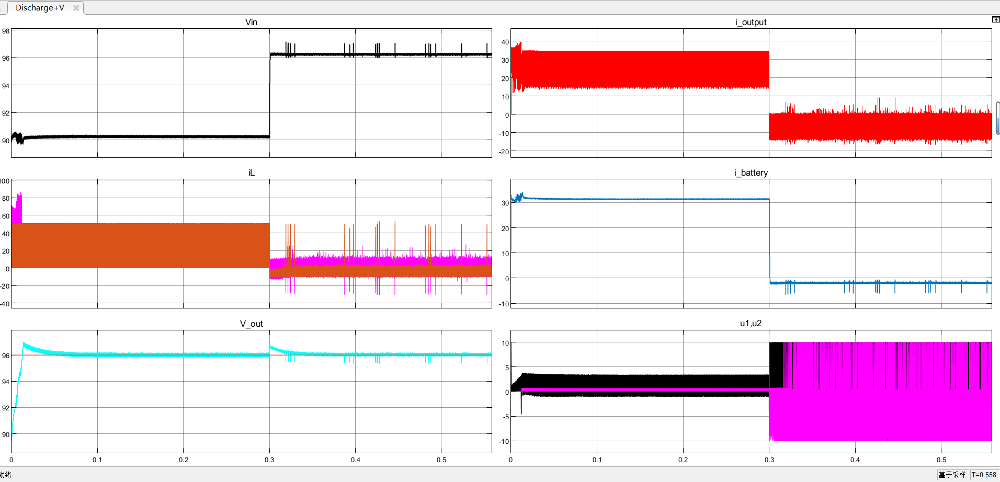
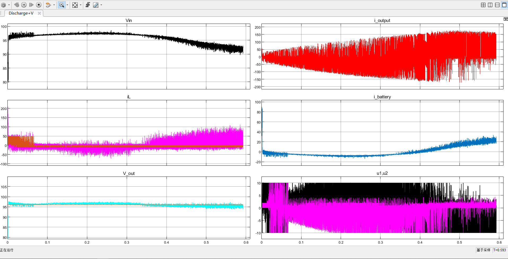

# 电池+光伏+电机+逆变器平台搭建

> [项目进度文档](https://epropulsion.feishu.cn/sheets/IQL3syBPyhlp1xtGgYKcxKVFnvd)

- Directory structure

  ```shell
  ./SimulationPlatform_11/NEW_motor3.slx  # 电机模块
  ./SimulationPlatform_11/single_inverter.slx  # 逆变器模块
  
  ./SimulationPlatform_11/rectifire_single_inverter_pv1.slx  # 集成仿真
  ```

- 需求

  将各个模块并联，电机作为负载。电池&光伏作为电源，光伏不要求维持 96V

- 电机
  $$
  P=(T_e*n)/9550
  $$
  

  转矩 5 nm, 功率 1.6 kw

  20nm -> 13kw


- 逆变器

  输入侧电容可能会影响

> 电池的输出额定功率（输出 u*i, 10kw）如果超过10kw输出母线电压要下降。 

## Exp

**Battery + PV**

母线连接 Battery, PV 模块，加上满载时的电阻 3.072 ohms. 电阻 0.3s 从满载切换为 0.

> 外部无负载，电池输出电压存在 0.5V 震荡，出现反向充电情况




**Battery + PV + motor**




## Q&A

- 电池模块充放电切换指令如何控制？
